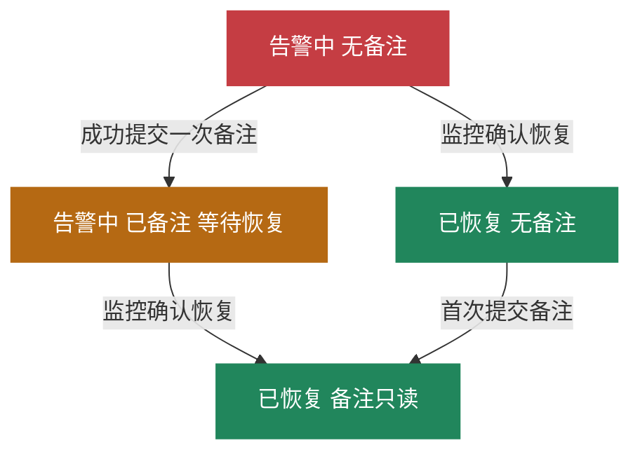

# 指标告警卡片实现说明

本文面向后续开发和测试，说明已确认的指标告警卡片如何展示、如何添加备注，以及如何根据监控事件自动恢复。产品交互以当前设计稿为基线；下文的数据字段和服务职责是实现建议，不代表已接入业务服务。

指标问题在服务器、服务或采集规则侧处理。人员在卡片上记录处置情况，监控在确认恢复后发送恢复事件，平台据此结束本轮告警。**提交备注只记录处置情况，不会将告警改成已恢复。**

- [钉钉指标告警设计稿](https://editor.dingtalk.com/editor?templateId=c40f5afb-096e-4088-af73-d5650bd3f3e2.schema&scene=open_platform&bizId=1791096476615&customBuilder=false&corpId=ding6d039ea9a87c3a7235c2f4657eb6378f&appId=5036643162)
- [设计预览与视觉规格](/Users/seven/work/worktrees/ai-alertops/metric-alert-card-design/design/metric-alert-card/README.md)
- [卡片模板备份](/Users/seven/work/worktrees/ai-alertops/metric-alert-card-design/design/metric-alert-card/metric-alert-card.json)

## 首次告警如何展示

首次收到某一轮指标告警的 `firing` 事件时，创建该轮告警记录，并向配置的目标群发送卡片。标题栏显示红色的「指标告警 · 告警中」，正文让查看者能直接识别问题对象、指标和触发条件。

卡片展示告警名称、实例或服务、环境、指标键及主要维度、指标值和单位、阈值及触发条件、首次告警时间、最近接收时间和持续时间。未提供的数据不能使用预览中的固定值补齐。

初始卡片只显示「添加备注」按钮。备注输入框、提交按钮、备注作者和时间均隐藏，也不展示空的备注信息块。

本设计的业务操作只有添加备注，不提供认领、标记处理中、静默或人工关闭入口。人员可以直接去源端排查和处置，不需要先在卡片上认领。

## 备注用于记录什么

备注用于记录本轮问题的来源、已经采取的措施和仍需观察的事项，便于群内其他人了解处置情况。正文保持一个自由文本框，不增加原因分类、负责人等必填表单。

例如，可以填写「已修正采集规则中的阈值配置，等待监控确认恢复」，也可以填写「已处理服务器上的异常进程，继续观察 CPU 指标」。备注中写了“已修复”，也只表示提交者记录了这项处置，最终恢复仍以监控事件为准。

同一轮告警共用一条备注，所有目标群和查看者看到相同的内容。**只允许成功提交一次，提交后不能追加、修改或删除。** 因此，用户可以在提交前修改草稿，提交成功后卡片只读展示备注内容、作者和提交时间。

## 备注交互

| 阶段 | 卡片展示 | 用户操作与结果 |
| --- | --- | --- |
| 尚未展开 | 仅显示「添加备注」 | 点击后展开输入框和「提交备注」，添加按钮隐藏 |
| 正在填写 | 显示输入框和提交按钮 | 可以修改尚未提交的文字；输入本身不改变告警状态或标题栏颜色 |
| 正在提交 | 保留填写内容，防止重复点击 | 等待服务端确认，不能提前当作已保存 |
| 提交成功 | 显示备注内容、作者和时间 | 输入框和所有备注按钮消失；本轮不再提供填写入口 |
| 保存失败且本轮仍无备注 | 保留草稿和提交入口 | 服务端确认未保存后，显示失败原因，允许修正或重试 |

空内容及仅包含空白的内容不能提交。前端用于及时提示，服务端仍须校验。备注作者来自经过校验的回调身份，提交时间由服务端记录，不能采信输入参数自行声明的作者或时间。

输入框的展开状态和未提交草稿属于当前用户的临时交互，不写成告警业务状态，也不广播给其他查看者。是否已有备注以服务端已保存的数据为准，不能只依赖客户端隐藏按钮。

## 告警状态与颜色

监控状态只有 `firing` 和 `resolved`。「已备注」是根据备注是否成功保存得到的展示结果，不增加一个“人工已处理”的监控状态。

| 监控状态 | 是否已有备注 | 标题栏文案与颜色 | 备注区域 |
| --- | --- | --- | --- |
| `firing` | 无 | 告警中，红色 | 可展开填写 |
| `firing` | 有 | 已备注 · 等待恢复，琥珀橙 | 只读显示 |
| `resolved` | 无 | 已恢复，绿色 | 允许首次添加，提交后仍为绿色 |
| `resolved` | 有 | 已恢复，绿色 | 只读显示 |

渲染时先判断是否已恢复，再判断是否已有备注。即使恢复和备注提交先后到达，最终也应展示绿色的已恢复卡片，并保留已保存的备注。

视觉沿用日志告警卡的彩色标题栏、白色正文、浅灰信息块和原生按钮。红、琥珀橙、绿三阶段的具体色号、深色配色、字号和间距见视觉规格文档。指标仍告警时，指标值保留告警强调色。

## 重复告警和自动恢复

### 同一轮持续告警

同一问题在尚未恢复期间继续收到 `firing` 时，更新本轮的指标值、最近接收时间等观测信息，并更新对应群内的原卡片。保留首次时间和已提交备注，不重新开放备注入口，不因一次重复通知新建一张卡。

如果已有备注但指标持续异常，卡片继续显示「已备注 · 等待恢复」。备注不暂停监控，不屏蔽后续更新，也不启动一个定时自动关闭流程。

### 监控确认恢复

收到能够匹配本轮告警的有效 `resolved` 事件后，平台自动将本轮标记为已恢复，记录恢复时间，并把原卡片标题栏改为绿色。正文显示「监控已确认恢复，本轮告警自动结束」。已有备注及其作者、提交时间保持原样。

恢复不要求事先填写备注。没有备注的红色卡片可以直接变绿；恢复后仍未填写过备注时，允许首次补记，补记不会重新打开告警。

恢复必须有明确的来源信号。仅修改了规则、暂停采集、暂时没有新告警或用户提交了备注，都不能由卡片自行推断为恢复。

### 恢复后再次发生

确认是恢复后的新一次告警时，创建新一轮记录和新卡片。新卡片从红色、无备注开始，允许重新填写本轮的一条备注；旧卡片保持绿色及原有记录。

迟到或重复的旧事件不等于新一轮告警。实现时必须能关联来源事件所属轮次，避免迟到的 `firing` 新建错误轮次，也避免上一轮的 `resolved` 结束当前轮次。无法明确匹配的恢复事件应记录并处理关联异常，不得直接关闭同一指标的最新一轮。

## 一次完整流程示例

以下时间、指标值和文本均为示例，不是生产默认值。

| 时间 | 发生的事情 | 卡片结果 |
| --- | --- | --- |
| 10:02 | 首次收到 CPU 告警，触发条件为使用率不低于 85% 且持续 5 分钟 | 红色「告警中」，备注框隐藏 |
| 10:20 | 本轮再次收到告警，观测值为 92.6% | 更新原卡的指标值和最近接收时间 |
| 10:21 | 人员修正采集规则后，点击添加并提交「已修正规则，等待监控恢复」 | 琥珀橙「已备注 · 等待恢复」，备注只读 |
| 10:32 | 收到本轮恢复事件；若事件包含有效恢复观测值 43.2%，则展示该值 | 原卡变绿，恢复时间固定，备注保留 |
| 11:10 | 来源确认同一指标发生新一轮异常 | 新建红色卡片，新轮次备注为空 |

如果 10:32 尚未收到恢复信号，卡片就继续等待恢复。备注内容不能替代这一事件。

## 实现所需的数据和职责

以下为逻辑数据建议，字段名用于说明含义，不限定表结构或接口路径。优先复用实现项目已有的告警记录、身份校验和卡片更新能力。

| 数据 | 用途和约束 |
| --- | --- |
| 本轮告警标识 `roundId` | 唯一标识一次发生到恢复的过程；备注提交和卡片回调必须绑定这个标识 |
| 聚合依据 | 用于判断持续告警是否属于同一问题；现有系统使用实例 ID 和指标键，新系统需确认环境、规则及指标维度如何区分 |
| 来源轮次与事件信息 | 用于匹配恢复、去重和识别迟到事件；按实际来源提供的身份、开始时间或序列信息确定，不能只按到达顺序判断 |
| 监控状态 `monitorState` | `firing` 或 `resolved`，由监控事件处理逻辑维护 |
| 指标及对象信息 | 名称、实例或服务、环境、指标键、必要维度、值、单位、规则及观测时间；缺失值要明确表达 |
| 业务时间 | 首次告警时间、最近接收时间、恢复时间；保留各自语义，不能混用 |
| 备注 `note` | 未提交时为空；提交后包含正文、作者标识、显示名和提交时间，整轮只写入一次 |
| 卡片关联 | 保存本轮与各目标群的卡片实例标识，例如平台实际使用的 `outTrackId`，供后续更新原卡使用 |

时间展示使用约定时区，当前设计按 UTC+8 展示；跨日时应带日期。传输和存储形式沿用接入项目的时间规范。最近接收时间指平台收到事件的时间，不能当作指标真实采样时间。

持续时间建议按本轮开始至本次卡片渲染的时间计算，恢复后固定为开始至恢复的时长；单位统一计算后再格式化展示。该计算口径需在接入时与来源时间定义一起落实，不能硬编码预览中的“18 分钟”或“30 分钟”。

恢复事件未携带可靠观测值时，可以显示「恢复值未提供」，或明确标注“末次告警值”及其时间，不能把旧异常值涂成绿色后当作恢复值。预览中的 43.2% 仅用于演示。

### 处理职责

| 入口 | 应执行的职责 |
| --- | --- |
| 接收首次或重复告警 | 校验来源，识别问题及轮次，保存或更新观测信息，创建或更新对应卡片 |
| 点击添加备注 | 展开当前用户的填写区域，不更改告警状态 |
| 提交备注 | 校验回调身份、访问权限、轮次和内容，原子保存首次备注，返回服务端最新状态并更新本轮相关卡片 |
| 接收恢复事件 | 匹配轮次，记录恢复状态和时间，保留备注，更新原卡 |
| 渲染卡片 | 根据最新监控状态和备注生成展示，不根据按钮名称或备注正文推断业务状态 |

备注提交只修改备注数据；监控事件只修改对应的监控数据。卡片回调不能用“实例 ID＋指标键查最新一轮”的结果代替原卡绑定的轮次，否则点击旧卡可能把备注写入新告警。

正式模板应删除「设计预览」「模拟监控恢复」等演示控件，并用服务端数据替换本地演示变量、模拟身份和固定时间。当前 JSON 是设计器导入备份，不能直接当成业务发送参数使用。

## 并发和失败处理

每轮只能保存一条备注，需要由服务端原子保证。两个人同时提交时，只接受首先成功写入的一条；另一人收到已有备注和最新卡片状态，不覆盖正文、作者或时间。即使备注内容相同，也不能仅凭文字相同判断为同一次请求。

对于同一次请求的重试，应识别已经完成的提交并返回原结果。若提交结果因网络中断不明确，先查询服务端状态，再决定是否允许重试，避免把已保存的备注当作失败后重新写入。

备注成功保存但卡片更新失败时，备注仍然有效。应明确区分“备注未保存”和“备注已保存、卡片待更新”，后续根据最新业务数据重试卡片更新，不回滚或覆盖备注，也不再开放第二次填写。

监控恢复与备注提交并发时，两项有效变更都必须保留。卡片更新也要避免旧数据覆盖新状态：最终应收敛为「已恢复＋已有备注」，不能因为晚到的备注回调把卡片退回琥珀橙，或因恢复更新丢失备注。

## 验收场景

| 场景 | 预期结果 |
| --- | --- |
| 首次告警 | 红色标题栏，只显示添加备注入口 |
| 点击添加备注 | 输入框和提交按钮出现，添加按钮隐藏 |
| 输入但未提交 | 保持原监控状态和颜色，其他用户看不到草稿 |
| 空白备注 | 前后端均拒绝保存，不进入已备注状态 |
| 告警中首次提交成功 | 变为琥珀橙，展示正文、作者、时间，所有备注编辑入口消失 |
| 已有备注后收到重复告警 | 更新观测信息，保留备注，不新增卡片或重新开放填写 |
| 已有备注后收到恢复 | 原卡变绿，备注和提交时间保持不变 |
| 无备注时收到恢复 | 直接变绿，不要求先补备注 |
| 恢复后首次添加备注 | 保存后仍为绿色，仅展示只读备注 |
| 多人或多群同时提交 | 本轮只有一条成功记录，各卡片最终展示同一结果 |
| 同一请求重试 | 返回原结果，不重复写入或改变作者、时间 |
| 保存失败且本轮仍无备注 | 保留草稿和提交入口，不伪装成已备注 |
| 保存成功但卡片更新失败 | 保留已保存记录，重试展示更新，不允许第二条备注 |
| 提交和恢复并发 | 最终为绿色，并保留首次成功备注 |
| 明确的新一轮告警 | 新建红色卡片，备注为空，旧卡不变 |
| 迟到的旧事件或旧卡回调 | 只关联原轮次，不能影响新一轮记录 |
| 缺少恢复观测值 | 明确表达缺失或末次告警值，不伪造正常值 |
| 正式模板 | 无演示恢复按钮、模拟身份和固定指标数据 |

## 接入现有系统时的参考

现有平台的[告警入口](/Users/seven/work/projects/alarm-plaform/service/alertmanager_service.go:20)区分首次、重复和恢复事件；[聚合查询](/Users/seven/work/projects/alarm-plaform/repository/impl/alertmanager_impl.go:41)使用实例 ID 和指标键。[重复事件处理](/Users/seven/work/projects/alarm-plaform/repository/impl/alertmanager_impl.go:112)中的最近时间来自平台接收时钟。这些代码可用于理解现状。

旧版[卡片回调](/Users/seven/work/projects/alarm-plaform/service/card_event_callback.go:144)包含认领、屏蔽和人工关闭，并限制已关闭后的操作；这些规则不能直接作为本卡片的备注逻辑。需要独立的首次备注能力，允许已恢复但无备注的轮次补记。[旧版自动恢复逻辑](/Users/seven/work/projects/alarm-plaform/repository/impl/alertmanager_impl.go:163)会写入自动恢复说明，新实现应保证这类说明不会覆盖用户备注。

现有[发送参数生成](/Users/seven/work/projects/alarm-plaform/service/alertmanager_service.go:253)使用当前请求的追踪标识。实现更新原卡时，需要明确保存和复用每轮告警、每个目标群对应的卡片标识，不能把每次事件的新请求标识都当作新的卡片实例。

## 接入时需要确定的参数

交互规则已经确定，以下事项需要结合真实数据和目标项目落实，不影响本设计稿的使用：

- 聚合依据和来源轮次的识别方式，特别是不同环境、规则及维度是否应分开告警。
- 首次时间、恢复时间的来源与缺失处理，以及持续时间的最终计算口径。
- 回调身份与提交权限的对应关系、备注长度上限、校验提示和请求去重标识。
- 实际卡片创建与更新协议、卡片标识存储方式及更新失败后的重试机制。

当前完成范围为设计和模拟交互验证。后续代码实现应以上述业务规则和验收场景为依据，再验证真实监控事件、备注持久化、多人操作及群内卡片更新。
