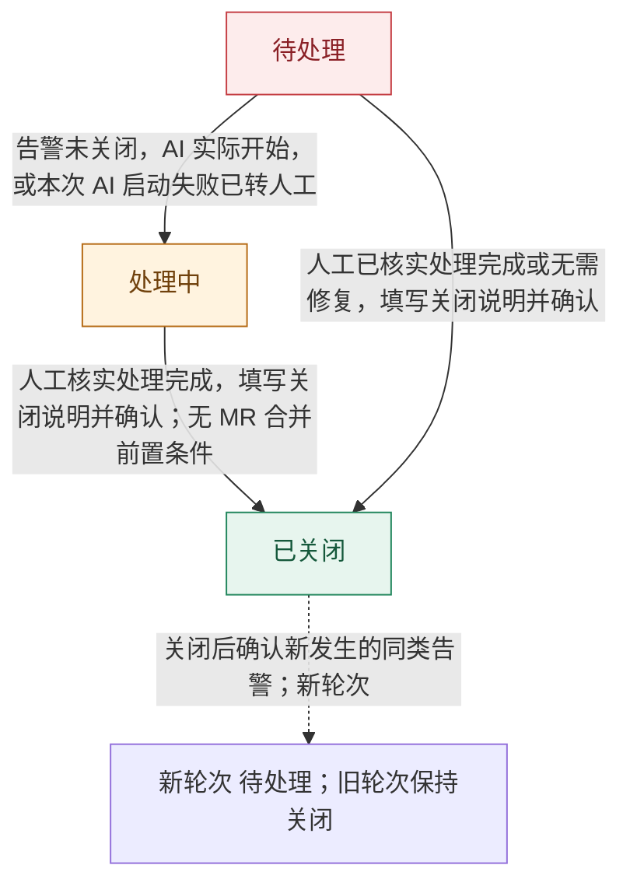

# 日志告警卡片流程对照说明

本说明与钉钉卡片设计稿使用相同的状态和场景数据。场景切换、点击 Trace ID 复制、增加备注展开输入框、取消收起及文本输入可在预览中操作；备注提交与其他业务操作仅展示说明，未接入告警、AI、Codeup 或发布服务。

## 主状态

| 主状态 | 标题颜色 | 默认操作入口 |
| --- | --- | --- |
| 待处理 | 红色 | 增加备注、确认关闭、查看完整处理记录 |
| 处理中 | 琥珀橙 | 增加备注、查看完整处理记录、确认关闭 |
| 已关闭 | 绿色 | 查看完整处理记录 |

待处理和处理中默认提供确认关闭，不依赖 AI 结果、AI 是否结束、MR 是否存在或是否全部合并。人工核实处理完成后填写关闭说明；日常备注可选。备注编辑期间先完成或取消编辑，再回到默认操作行。已关闭后隐藏确认关闭。AI 若仍在运行则继续，后续结果仅保留为记录，不重新打开卡片。

取消认领、接管与手动更新进展入口。人工备注支持零条、一条或多条，自动记录填写人和提交时间，不影响 AI 执行。卡片展示最近三条，完整内容通过处理记录访问。

## 按场景对照

前八个场景组成首次告警、AI 排查、备注追加、MR 合并、发布验证和关闭的主流程。其余场景演示 AI 不同结论与异常交付。

## 状态流转图

## 逐步预览

### 01 首次告警 · 无备注

进入条件：首次收到同类告警，创建本轮唯一卡片，AI 尚未开始执行。

卡片标题：日志告警 · 待处理

正文标题：等待 AI 开始处理

正文内容：

- 开始后自动更新此卡片，同类告警持续累计。

人工备注（共 0 条）：

暂无人工备注。

### 02 AI 排查 · 无备注

进入条件：AI 实际开始执行。

卡片标题：日志告警 · 处理中

正文标题：AI 正在排查

正文内容：

- 正在分析日志、识别关联仓库，定位后修复并提交 Codeup MR。

人工备注（共 0 条）：

暂无人工备注。

### 03 AI 排查 · 一条备注

进入条件：人工添加一条备注；AI 继续当前任务，主状态不变。

卡片标题：日志告警 · 处理中

正文标题：AI 正在排查

正文内容：

- 正在排查业务仓库与公共 SDK，人工备注不影响本次任务。

人工备注（共 1 条）：

- 张三 · 2026-10-04 10:02：已核对告警来源，生产仍在使用旧版本。AI 继续排查。

### 04 修复交付 · 合并 0/2

进入条件：AI 完成必要修复、本地校验及 MR 交付，本次任务结束。

卡片标题：日志告警 · 处理中

正文标题：AI 已完成修复

正文内容：

- 设备属性缺失时未判空，导致入库异常。
- 本地校验通过，请人工评审修复。

独立 MR 入口：

- 业务仓库 !128 ↗ · 待评审
- 公共 SDK !76 ↗ · 待评审

人工备注（共 1 条）：

- 张三 · 2026-10-04 10:02：已核对告警来源，生产仍在使用旧版本。AI 继续排查。

### 05 部分合并 · 合并 1/2

进入条件：Codeup 通知一个必要 MR 已合并，平台更新独立 MR 状态。

卡片标题：日志告警 · 处理中

正文标题：请评审剩余修复

正文内容：

- 仍有必要 MR 未合并，全部合并后安排测试上线。

独立 MR 入口：

- 业务仓库 !128 ↗ · 已合并
- 公共 SDK !76 ↗ · 待评审

人工备注（共 1 条）：

- 张三 · 2026-10-04 10:02：已核对告警来源，生产仍在使用旧版本。AI 继续排查。

### 06 全部合并 · 多条备注

进入条件：全部必要 MR 已合并，人工追加测试结果和预计上线时间。

卡片标题：日志告警 · 处理中

正文标题：修复已合并，等待发布

正文内容：

- 请按计划完成测试、上线和生产验证。

独立 MR 入口：

- 业务仓库 !128 ↗ · 已合并
- 公共 SDK !76 ↗ · 已合并

人工备注（共 3 条）：

- 李四 · 2026-10-04 14:30：测试通过，预计今晚 20:00 随 V3.8.2 上线。
- 张三 · 2026-10-04 11:20：两个修复已合并，已交给测试。
- 张三 · 2026-10-04 10:02：已核对告警来源，生产仍在使用旧版本。AI 继续排查。

### 07 上线观察 · 四条备注

进入条件：人工再次追加备注，保留所有历史记录；卡片展示最近三条。

卡片标题：日志告警 · 处理中

正文标题：已进入上线验证阶段

正文内容：

- 请结合最新记录完成生产验证，再确认关闭。

独立 MR 入口：

- 业务仓库 !128 ↗ · 已合并
- 公共 SDK !76 ↗ · 已合并

人工备注（共 4 条）：

- 张三 · 2026-10-04 20:15：V3.8.2 已上线，正在观察设备入库情况。
- 李四 · 2026-10-04 14:30：测试通过，预计今晚 20:00 随 V3.8.2 上线。
- 张三 · 2026-10-04 11:20：两个修复已合并，已交给测试。
- 张三 · 2026-10-04 10:02：已核对告警来源，生产仍在使用旧版本。AI 继续排查。

### 08 上线验证后关闭

进入条件：AI 已结束，必要修复已合并、上线并通过生产验证，人工填写关闭说明并确认。

卡片标题：日志告警 · 已关闭

正文标题：修复已上线，验证完成

正文内容：

- 上线版本：V3.8.2
- 关闭说明：设备属性缺失与正常入库场景均验证通过。
- 关闭人：张三 · 2026-10-04 20:30

独立 MR 入口：

- 业务仓库 !128 ↗ · 已合并
- 公共 SDK !76 ↗ · 已合并

人工备注（共 4 条）：

- 张三 · 2026-10-04 20:15：V3.8.2 已上线，正在观察设备入库情况。
- 李四 · 2026-10-04 14:30：测试通过，预计今晚 20:00 随 V3.8.2 上线。
- 张三 · 2026-10-04 11:20：两个修复已合并，已交给测试。
- 张三 · 2026-10-04 10:02：已核对告警来源，生产仍在使用旧版本。AI 继续排查。

### 09 AI 定位没问题

进入条件：AI 未发现明确问题，本次任务结束，等待人工核查。

卡片标题：日志告警 · 处理中

正文标题：AI 未发现明确问题

正文内容：

- 所检查代码未发现对应缺陷。请人工核对线上版本和告警来源，按需记录处理计划。

人工备注（共 0 条）：

暂无人工备注。

### 10 AI 无法定位

进入条件：AI 缺少证据，结束本次任务；人工直接继续排查，无需接管操作。

卡片标题：日志告警 · 处理中

正文标题：AI 无法确定根因

正文内容：

- 缺少告警时刻的关联日志和运行版本。已有排查记录已保留，请人工继续处理。

人工备注（共 0 条）：

暂无人工备注。

### 11 人工记录原因与计划

进入条件：AI 已结束，人工追加原因、处置方案和发布安排，主状态不变。

卡片标题：日志告警 · 处理中

正文标题：请结合人工结论继续处理

正文内容：

- AI 排查已结束，核查原因与发布安排见下方备注。

人工备注（共 1 条）：

- 张三 · 2026-10-04 11:00：原因：线上版本较旧，修复代码已存在。已安排测试，预计明晚统一上线。

### 12 人工确认无需修复 · 无备注

进入条件：人工复核确认无需修复，填写明确的关闭原因和依据；不要求此前存在备注。

卡片标题：日志告警 · 已关闭

正文标题：人工确认无需修复

正文内容：

- 关闭说明：业务校验日志被误识别为异常，已核对接口约定并完成规则处置验证。
- 关闭人：张三 · 2026-10-04 11:30

人工备注（共 0 条）：

暂无人工备注。

### 13 AI 交付未完成

进入条件：AI 执行失败或交付不完整，本次执行结束，保留已有成果供人工继续处理。

卡片标题：日志告警 · 处理中

正文标题：部分修复尚未完成

正文内容：

- 公共 SDK 校验未通过，已有业务仓库分支与 MR 已保留。请人工继续完成修复。

独立 MR 入口：

- 业务仓库 !128 ↗ · 待评审

人工备注（共 0 条）：

暂无人工备注。

### 14 上游缺少 Trace ID

进入条件：上游告警没有消息追踪 ID，卡片提示缺失，不提供复制交互。

卡片标题：日志告警 · 处理中

正文标题：AI 正在排查

正文内容：

- 正在分析日志、识别关联仓库，定位后修复并提交 Codeup MR。

人工备注（共 0 条）：

暂无人工备注。

### 15 AI 无法定位 · 人工上线后关闭

进入条件：AI 无法定位后，人工完成排查、修复、上线及验证，填写关闭说明并确认；无需关联 MR 或等待合并回调。

卡片标题：日志告警 · 已关闭

正文标题：人工处理完成，已关闭

正文内容：

- AI 结论：无法确定根因，排查记录已保留。
- 关闭说明：人工修复设备属性缺失的兼容问题，已上线并验证入库正常。
- 关闭人：张三 · 2026-10-04 20:30

人工备注（共 2 条）：

- 张三 · 2026-10-04 20:20：人工修复已上线，设备入库验证通过。
- 张三 · 2026-10-04 11:00：已定位：旧设备上报缺少属性，正在补充兼容处理。

### 16 AI 未能启动 · 人工处理

进入条件：AI 调度或启动失败，平台确认本次任务终止，转由人工处理；本轮不重试 AI。

卡片标题：日志告警 · 处理中

正文标题：AI 未能启动，请人工处理

正文内容：

- 本次 AI 任务未能启动，失败原因已保留。请人工排查，完成后可以直接确认关闭。

人工备注（共 0 条）：

暂无人工备注。

### 17 人工先关闭 · AI 仍在运行

进入条件：人工已经完成处理并验证，填写关闭说明并确认；AI 仍在运行，不中断本次任务。

卡片标题：日志告警 · 已关闭

正文标题：人工处理完成，已关闭

正文内容：

- 关闭说明：人工发布兼容修复并验证入库正常。
- 关闭人：张三 · 2026-10-04 20:30
- AI 仍在运行，后续结论继续保留在处理记录中。

人工备注（共 2 条）：

- 张三 · 2026-10-04 20:20：人工修复已上线，设备入库验证通过。
- 张三 · 2026-10-04 11:00：已定位：旧设备上报缺少属性，正在补充兼容处理。

### 18 AI 后续交付 · 保持已关闭

进入条件：已关闭轮次收到其原 AI 任务的完成结果或 Codeup 通知；只补充本轮记录，不重新打开，不影响其他轮次。

卡片标题：日志告警 · 已关闭

正文标题：人工处理完成，已关闭

正文内容：

- 关闭说明：人工发布兼容修复并验证入库正常。
- 关闭人：张三 · 2026-10-04 20:30
- AI 后续完成修复并提交 MR，已记录供人工参考；卡片保持关闭。

独立 MR 入口：

- 业务仓库 !128 ↗ · 待评审
- 公共 SDK !76 ↗ · 待评审

人工备注（共 2 条）：

- 张三 · 2026-10-04 20:20：人工修复已上线，设备入库验证通过。
- 张三 · 2026-10-04 11:00：已定位：旧设备上报缺少属性，正在补充兼容处理。

### 19 关闭后新告警 · 新一轮

进入条件：确认事件新发生于上一轮关闭之后，创建独立新轮次与卡片，允许新轮次执行一次 AI；上一轮保持关闭。

卡片标题：日志告警 · 待处理

正文标题：新一轮告警，等待 AI 开始

正文内容：

- 上一轮已经关闭。本次新建卡片，独立累计并执行一次 AI；历史备注与 MR 留在上一轮。

人工备注（共 0 条）：

暂无人工备注。

## 告警聚合和新轮次

- 同类告警的去重与本轮卡片关联是两件事：事件唯一键用于识别重复投递，问题聚合键用于归入同一类，轮次 ID 用于隔离一次处理过程。
- 同一轮、同一目标群只创建一次卡片；首次创建后持久化卡片实例标识，重复事件更新该标识对应的原卡。Trace ID 不能充当问题聚合键或卡片实例 ID。
- 唯一告警事件递增累计次数；同一事件重复投递不再次累加。首次和最近按可信事件发生时间取最早和最晚，乱序不让最近时间倒退；ID 与异常摘要取同一最近事件。
- 关闭后的新发生事件创建下一轮，重置次数、首次时间、备注和 AI 任务；保留上一轮关联供查阅，旧轮次保持关闭。
- 旧事件及回调必须绑定所属轮次，不能通过同类告警的最新记录来猜测目标。不能可靠识别归属的事件进入关联异常记录，交给人工核实。

## 合并请求入口

- 每条已创建或已关联的 Codeup MR 单独一行，仓库名与编号组成入口，独立展示该 MR 状态。
- 每个 MR 使用自身完整 Codeup URL，以仓库与 MR 标识关联告警；两条 MR 必须有两个入口。
- 处理期间和关闭后保留已有 MR 入口；交付失败时保留实际已创建的 MR，不为尚未创建的 MR 生成链接。
- 查看 MR 不改变卡片主状态，MR 合并也不自动关闭。
- 预览编号与备注均为模拟数据，MR URL 为空；正式接入时各行绑定真实地址。

## 流转规则

- 主状态仅有待处理、处理中、已关闭，分别使用红色、琥珀橙、绿色。告警未关闭时，AI 开始后，评审、测试、上线、返工均保持处理中。
- 同类告警在本轮处理期间只创建一张卡，重复告警只更新次数、最近时间与证据，不清空备注或重复启动 AI。
- 第一阶段取消认领、人工接管、停止 AI、重试和更新处理进展入口。AI 自主完成本次任务；备注不改变 AI 执行，也不构成追加指令。
- AI 每轮仅执行一次，完成或失败后结束，不无限运行、不自动重试。AI 的三个业务结果保留在正文；异常终止单独记录原因。
- 告警未关闭时，AI 未发现问题、无法定位或交付未完成均保持处理中。人工直接核查和处置，无需接管按钮；完成后可手动关闭。
- 备注可以为零条、一条或多条，每次提交追加一条，记录内容、填写人和服务端提交时间，保留历史。备注不要求填写预计上线时间。
- 备注是可选的；用户选择提交时，内容不能只有空白。填写人和记录时间自动生成，不需手填。预计上线时间按需写入正文，与备注创建时间分开理解。
- 卡片按时间倒序展示最近三条备注，长备注显示摘要；查看处理记录展示全部备注原文及 AI、MR、关闭记录。
- 普通备注和处理计划不改变主状态，不构成关闭依据的自动判定；系统自动更新不得覆盖已有人工备注。
- 每个 Codeup MR 独立展示链接和状态；平台接收 Webhook 后核对并同步进度，不需要人工点击更新。合并事件不自动关闭，也不重新打开已关闭卡片。
- 合并后由人工启动流水线、测试、上线与生产验证；不接入 CI 自动推进。测试失败由人工继续处理，主状态保持处理中。
- 待处理和处理中默认提供确认关闭入口；不依赖 AI 定位结果、运行状态、MR 是否存在或是否全部合并。MR 状态仅供人工参考，不能成为人工关闭的硬性门槛。
- 人工确认已完成修复上线及验证，或核实无需修复，填写关闭说明后关闭并记录关闭人、关闭时间。定位到原因、已有计划或单纯添加备注都不自动关闭；日常备注可选，不要求先添加备注。
- 关闭只结束告警问题，不取消或重试正在运行的 AI。若 AI 仍在运行，关闭确认提示中明确说明；后续 AI 结果与 MR 回调保留为记录，不把已关闭卡片改回处理中。已经关闭的问题不再启动尚未开始的 AI 任务。
- 关闭后收到新发生的同类告警，创建独立新轮次和新卡片，并允许该轮执行一次 AI；旧卡保持关闭。上一轮备注、MR 和 AI 结果留在旧轮次，不自动复制到新轮次。
- 迟到日志、重复投递以及旧 AI/MR 回调按原事件和轮次归档，不等于复发。缺少可信发生时间或轮次信息时，记录待核实的关联异常，不凭接收先后新建轮次，也不改写新轮次。
- AI 未能启动且本次任务已终止时进入处理中并提示人工处理，本轮不重试。人工仍可添加备注或在完成后关闭。

## 备注交互

- 备注输入框默认隐藏，待处理或处理中默认显示增加备注和确认关闭；点击增加备注后展开输入框及提交备注、取消操作，完成或取消编辑后回到默认按钮行。
- 取消只收起本地输入区，不生成备注。正式提交成功后追加记录并收起输入区；提交失败时保留输入供人工处理。
- 零条备注显示暂无人工备注；一条显示一条；多条按记录时间倒序展示最近三条，完整历史通过查看处理记录访问。
- 一条备注由内容、填写人、提交时间组成；系统生成填写人和时间，预计上线时间可写在正文中。
- AI 运行时可追加备注，不暂停、重启或重新规划 AI；AI 完成后直接继续人工处理。
- 告警已关闭时，增加备注、输入框、提交备注及取消全部隐藏，即使本地编辑状态仍为展开；历史备注和查看完整处理记录保留。
- 当前预览支持备注展开、取消收起和本地输入；提交备注仅显示尚未保存的提示，未持久化到业务服务。

## 卡片排版

- 顶部使用红色、琥珀橙、绿色色块标识三个主状态，标题同时提供文字状态。
- 业务上下文只展示项目和服务名称，不展示生产等环境标签。告警信息使用浅灰蓝背景：累计次数与持续时间一行，首次与最近告警时间合并一行，同日省略最近时间的重复日期，跨日保留日期；下方依次展示可复制的完整 ID 和异常信息。
- 每个 MR 独立入口，合并数量集中在 MR 区显示。交付不完整时显示交付未完成，不把已创建 MR 数量误当全部必要修复。
- 备注逐条展示，填写人与月日时间使用次要字色，最新一条突出显示；完整记录保留完整日期和原文。
- 查看完整处理记录作为备注区链接；未关闭卡片默认底部显示增加备注和确认关闭；备注展开后切换为输入框和提交备注、取消，完成或取消编辑后恢复默认按钮行，最多两个按钮。
- 空备注、长文本和关闭状态分别提供紧凑展示；已关闭隐藏输入与处理按钮，保留备注和独立 MR 入口。
- 持续时间按本轮首次至最近一次告警事件的时间差计算；首条为 0 分钟，不将后续 AI 处理、人工备注或关闭等待时间计入。首次时间保留月日和时分，最近时间在同日只显示时分、跨日保留日期；完整时间戳保留于处理记录。

## 缺陷 ID 和复制

- 缺陷 ID 使用日志来源提供的 Trace ID，也称消息追踪 ID；放在异常信息上方，仅展示完整 ID，不加 traceId 等前缀。使用小号低饱和度蓝色文字，点击整行复制，与时间和异常信息共用浅灰蓝背景，不增加复制按钮。
- 复制内容只有完整 Trace ID，不包含标题、告警编号或省略号；已关闭后仍可查看和复制，便于复核定位。
- 同类告警聚合期间，展示最近一条告警的 Trace ID，并与最近日志摘要对应。历史告警事件各自保留 Trace ID 供完整记录查询。
- 上游未提供 Trace ID 时明确显示本条告警未提供 Trace ID，不提供复制交互，不使用聚合告警编号代替。
- 预览 Trace ID 为模拟数据；正式运行由原始日志字段映射，不能使用示例值。
