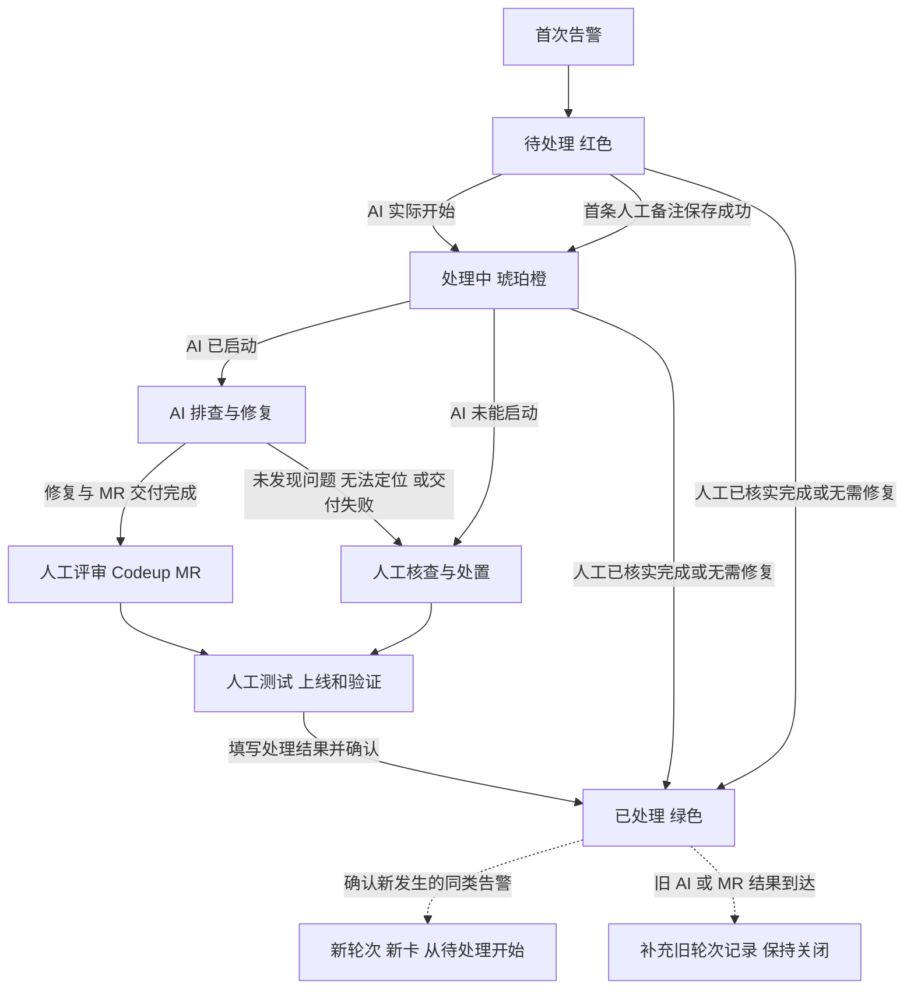

# 日志告警卡片设计说明

本文是日志告警卡片的业务设计和后续接入验收依据。同类日志告警在同一轮处理期间聚合为一个事项，监控事件和自动进展持续更新已有卡片；H5 成功提交且产生可见业务变更时，向来源群新增一条最新卡片通知。AI 每轮只执行一次，人工可随时记录进展，并在处理完成后手动关闭。关闭后确认新发生的同类告警创建下一轮卡片，旧轮次保持关闭。跨日志/指标的入口与通知规则见[吊顶与告警处理工作台设计](吊顶与告警处理工作台设计.md)。

范围是卡片展示、状态与事件关系、AI 和人工协作、Codeup MR 关联及失败边界。钉钉草稿已经设计和预览验证；真实告警接收、AI 执行、备注保存、关闭表单、权限校验和回调同步仍需后续实现。本文不表示这些服务已经可用。

跨卡片的已确认规则和后续边界统一见[告警卡片方案确认](告警卡片方案确认.md)。所有当前群成员均可操作本群告警；聚合与轮次识别参考原告警平台，具体接入验证不应误认为已经完成。

## 状态和按钮

| 主状态 | 标题颜色 | 进入条件 | 默认操作 |
| --- | --- | --- | --- |
| 待处理 `new` | 红色 `#C73E47` | 本轮首次告警已建卡，AI 尚未开始且尚无成功保存的人工备注 | 添加备注、标记已处理、查看完整处理记录 |
| 处理中 `processing` | 琥珀橙 `#AC6817` | AI 已实际开始，或首条人工备注已保存成功 | 添加备注、标记已处理、查看完整处理记录 |
| 已处理 `closed` | 绿色 `#21865C` | 人工核实处理完成或无需修复，填写处理结果并确认 | 查看完整处理记录、已有 MR 和 ID |

评审、测试、等待上线、人工处置、AI 无法定位、返工和执行失败都通过正文或备注表达，不增加主状态。AI 不会因新增备注或重复告警而被取消、重新规划或重试。

已删除独立“上线观察”场景，不增加发布按钮或发布验证阶段。发布和测试进展按需写在备注中。内部状态码 `closed` 保持不变，对用户统一显示“已处理”。

“标记已处理”不依赖 AI 结果、AI 是否结束、MR 是否存在或是否合并。备注输入区展开时，底部暂时显示“提交备注／取消”；完成或取消编辑后恢复默认操作行。“标记已处理”展开处理结果输入框及“提交并完成／取消”，提交成功才变绿。已处理后，备注输入和所有处理按钮隐藏。

上图的人工关闭入口始终由人工完成情况决定；MR 评审和上线是常规修复路径，不是按钮显示的技术前置条件。`E2` 是另一轮记录，不是把旧卡改回红色。

## 卡片内容与布局

标题栏显示“日志告警 · 状态”和问题标题，用颜色和文字共同表明阶段。正文依次为：

1. 项目和服务，例如“智享云 V3 / biz-iot”；不显示“生产”环境标签，但环境仍保留在业务来源数据中。
2. 浅灰蓝背景的告警信息区：累计次数与持续时间一行；首次与最近告警时间合并一行，同日省略最近时间的重复日期，跨日保留日期；其下为完整 ID 和异常摘要。
3. 当前处理结论和下一步，包括 AI 正在做什么、排查结果或人工处理结果。
4. 已有的 Codeup MR，各仓库一条独立入口和状态。
5. 人工备注与完整处理记录入口，底部提供当前允许的操作。

告警信息区浅色背景为 `#F3F6FA`，深色背景为 `#242932`，圆角 8 px。正文左右边距 16 px，信息区左右内边距 12 px；时间与日志为辅助文字。深色标题栏依次为 `#A83139`、`#8D5117`、`#1A6D4B`。

### 时间和累计次数

累计次数表示本轮收到的不同告警事件数量，同一事件的重复投递不重复计数。首次和最近时间使用来源中可信的事件发生时间，分别取最早与最晚；不能把接收时间冒充发生时间。若来源没有可靠发生时间，应明确标成“接收时间”并记录缺失，不伪造时间。

持续时间是本轮最近告警时间减首次告警时间。首条为 0 分钟；它不随 AI 执行、MR 合并、备注或等待发布增长。格式化使用统一时区，当前设计为 UTC+8；跨日显示日期，跨年需带年份，较长时长可显示天、小时和分钟。预览中的月日时分和分钟数均为模拟值，业务记录保留完整时间戳。

### ID 与异常摘要

缺陷 ID 就是来源日志的 Trace ID，即消息追踪 ID。放在异常信息上方，只显示 ID，不加前缀和复制按钮；使用低饱和度蓝色 `#5B7FA6`，点击整行复制原始完整值，成功后提示“复制成功”。长 ID 应换行，不能把截断的显示值复制出去。

重复告警更新为最近事件的 ID 与摘要，两者必须来自同一事件。历史 ID 保留在事件记录中；Trace ID 不是聚合编号，也不是钉钉卡片实例 ID。缺少 ID 时提示“本条告警未提供 Trace ID”并移除复制交互；已处理卡片仍可查看和复制。日志摘要可以截断展示，完整原文在处理记录中查阅。

## AI 与人工协作

AI 根据告警、关联日志、部署版本和仓库映射定位问题；项目可以对应多个仓库。多仓库本身不是停止条件：应识别真正受影响的仓库，分别拉取修复分支，完成修改和必要的本地校验，再向阿里云效 Codeup 提交各仓库的 MR。

| AI 结果或事件 | 卡片正文与人工动作 | 主状态 |
| --- | --- | --- |
| 定位成功并完成修复交付 | 展示原因、修复摘要、验证结果及每条 MR；人工评审并测试上线 | 处理中 |
| 定位没问题 | 展示已检查范围和依据；人工核查线上版本、来源及是否已经有修复 | 处理中 |
| 无法定位待人工 | 列出缺少的证据和已有排查结果；人工直接继续处理 | 处理中 |
| 执行、本地校验或 MR 交付失败 | 记录失败原因及已有成果，明确未完成范围；人工继续处理 | 处理中 |
| AI 未能实际启动且无人保存备注 | 说明启动失败，等待人工开始处理 | 待处理 |

技术执行失败单独记录，不冒充“定位没问题”或“修复已交付”，也不增加第四种卡片主状态。本轮不提供重试、续跑、认领、人工接管、停止 AI 或手动更新进展按钮；失败后的已有分支和 MR 继续可查。

AI 是否执行和卡片是否关闭是两件事。未启动前人工已经关闭，则不再启动；运行中人工已经完成处理并关闭，AI 继续本次任务，后续结果留在原轮次，不能重新打开卡片或覆盖处理结果。关闭也不自动撤销或合并已有 MR。

## 备注与人工关闭

备注可选，支持零条、一条或多条。人工可以写定位原因、修复方案、已交测试、预计上线时间和验证结果，不需要先认领或接管。填写人和提交时间由服务端生成，预计上线时间属于正文内容。

默认收起输入区；点击“添加备注”后展示输入框、“提交备注”和“取消”。点击原生输入组件会弹出文本填写窗口，窗口内的“提交”只把文字带回当前草稿；真正追加记录由卡片上的“提交备注”完成。取消输入窗口或取消编辑都不能追加一条业务备注。

备注提交成功后追加记录并收起、清空已提交草稿；失败时保留文字。相同请求重复回调只生成一次记录，不同人提交分别保留。卡片显示最近三条及作者、时间，历史链接可查完整原文。展开、仅输入、取消或保存失败不改变主状态。首条备注保存成功后，待处理变为处理中；后续备注保持处理中，不影响 AI 任务。

人工完成修复上线并验证，或确认无需修复时，点击“标记已处理”，填写一句处理结果并点击“提交并完成”；无需先写日常备注。处理人和完成时间由服务端记录。仅“已定位”“已交测试”“预计今晚发布”不足以代表处理已经完成，不自动关闭。

关闭成功才变绿，失败则保留当前状态和填写内容。两人同时关闭时只接受一次有效关闭，后续请求返回已处理结果，不覆盖原处理结果。关闭后的旧卡回调必须校验本轮状态，不能向已处理轮次追加新的人工备注，也不能操作下一轮。

备注提交与关闭并发时，以服务端提交顺序为准：备注先成功，则关闭后仍保留它；关闭先成功，则拒绝后续备注并返回已处理状态。已保存备注、AI 结果、MR 和关闭记录互不覆盖。

## Codeup 通知与卡片更新

每条 MR 使用自己的仓库、编号、完整地址和状态；两个 MR 必须有两个入口。平台按本轮关联的 MR 汇总 `0/2`、`1/2`、`2/2`，交付不完整时直接说明未完成范围，不能把“已创建 1 个 MR”当成所有必要修复都完成。

设计接入链路为 **Codeup Webhook → 告警平台校验并匹配仓库、MR 和轮次 → 更新业务记录 → 更新对应钉钉卡片**。正式接入需按租户实际支持的事件配置通知，并验证事件数据和鉴权，不能从本预览推断 Codeup 已配置好 Hook。

MR 事件不直接操作钉钉，不自动关闭，也不要求人工点击“更新进展”。重复、乱序、上一轮的通知不能倒退合并状态或影响新轮次；必要时读取 Codeup 当前状态核实。平台收到卡片更新失败时保留已成功保存的业务记录，后续重新投递最新展示，不要求 AI 重新执行。

合并后由人工启动相关流水线，完成测试、发布及生产验证。第一阶段不使用 CI 结果自动推进卡片；测试失败由人工继续处理。没有 MR 或平台未收到合并通知，也不妨碍人工在核实完成后关闭。

## 聚合与关闭后复发

同类问题、本轮处理、单个事件必须分别标识。用户已确认以原告警平台 `alarm-plaform` 的聚合和轮次处理设计为参考：日志按服务标识与消息摘要匹配，未结束则更新原记录、结束后再次触发则新建记录。已核对的代码依据见[方案确认文档](告警卡片方案确认.md#原平台参考依据)。具体来源字段适配和消息摘要规则在接入时核对，不由卡片样式决定；Trace ID、动态时间和变化的请求值不能使每条日志都变成新问题。

同一轮、同一目标群首次告警只创建一条首次通知，保存对应卡片实例标识。后续不同事件追加到本轮，更新次数、时间、ID 和摘要，保留备注、AI 结果和 MR；监控事件的重复投递不新增消息、不重复计数，也不重新启动 AI。

H5 人工操作成功且改变卡片可见业务内容时，允许发送本轮的最新卡片作为更新通知；这不是新问题或新轮次。每次有效提交在来源群最多产生一条通知，同一请求重试复用发送标识。原卡及新增通知卡关联同一轮次、读取同一状态，后续更新应同步所有已投放实例；所有旧入口均按当前业务状态校验操作。统计按告警事项去重，不能按卡片实例数累加。

**已确认的复发规则：关闭后新发生的同类告警创建独立新轮次和新卡片，并允许该轮执行一次 AI。** 新卡从红色待处理开始，次数从 1 起，备注和 MR 不自动继承；旧卡保留绿色和全部历史。

迟到的旧日志、旧 AI 结果和旧 MR 通知仍归原轮次，不等于复发。不能只按接收先后或“查同类问题最新一条”判断归属；无法可靠识别发生时间或轮次时，记录关联异常供人工核实，不猜测归属。旧卡的按钮也只能作用于绑定的旧轮次。

## 与吊顶统计和 H5 的联动

吊顶分别统计当前群日志与指标的待处理、处理中及未完成合计；入口按钮打开按当前群过滤的 H5 未完成列表。首条备注成功后，待处理减一、处理中加一，未完成合计不变。日志标记已处理或指标收到有效恢复事件后，才从未完成列表和统计移除；失败仍保留。AI 结果、MR 合并与普通备注不会自动移除任务。

两类未完成合计大于 0 时展示吊顶，仅有处理中也展示；合计归零时关闭整个吊顶，新事项出现后重新展示。隐藏吊顶不删除历史消息、不关闭已经打开的 H5。

H5 可查看多条告警及其详情，并直接追加备注、处理日志告警；指标告警由监控恢复，不新增人工恢复按钮。浏览、筛选、输入未提交、取消、失败及重复请求不新增群消息。新增备注即属于有效内容变化，即使主状态仍为处理中，也发送最新卡片；一次提交同时改变备注与状态，只发送一条。

吊顶不再依赖 `01 / 02 / 03` 定位历史消息。列表内如保留序号，仅用于显示顺序，操作目标始终绑定实际告警轮次。H5 入口为本系统的列表与详情，Mac 侧栏和移动半浮层的公开协议及真机验证边界见[消息详情跳转核查](消息详情跳转核查.md)。

## 接入职责与数据边界

以下是逻辑契约，不限定数据库表名、技术框架或接口路径。

| 数据或职责 | 必须满足的约束 |
| --- | --- |
| 问题聚合键、轮次 ID、来源事件唯一键 | 分别负责同类匹配、轮次隔离、投递去重；并发时同类问题至多有一个开放轮次 |
| 卡片关联 | 每轮、每目标群保存首次通知和 H5 操作通知的卡片实例 ID；同一次提交复用投递标识，创建超时先核实，避免重复发送 |
| 原始证据 | 保留实际接收到的 Trace ID、日志 `_id`、Pod、镜像、版本及来源时间；不伪造缺失字段 |
| AI 任务 | 每轮至多启动一次，记录执行结果、证据、分支和 MR；任务 ID 绑定原轮次 |
| 备注、关闭、MR | 分开保存，服务端按当前轮次状态和已验证用户身份校验操作 |
| 更新版本 | AI、备注、MR、关闭回调并发时保留各自数据，拒绝旧展示覆盖新状态；已处理优先于 AI 进度 |
| 卡片投递失败 | 区分业务保存失败与已保存但卡片待同步；显示错误并保留记录，展示补发不属于 AI 重试 |
| H5 操作通知 | 保存成功且产生可见业务变化才新增群消息；一项告警的一次有效提交，在来源群最多一条；浏览、取消、失败和请求重试不发送 |

输入区展开与未提交草稿属于当前用户的临时交互，不广播给其他人。所有当前告警群成员均可追加备注和标记本群日志已处理，不限定指定运维人员，不要求认领。群成员可登录平台，后台可在其登录后分配管理与运维权限；具体账号和权限配置留到后续功能设计。正式接入仍需落实回调身份、来源群、内容长度及请求去重标识；不能仅凭按钮隐藏来防止已处理卡片被修改。

来源事件识别、时间可靠性、已确认权限范围的校验方式、内容长度、回调鉴权和钉钉数据绑定是接入参数，须在实际业务实现时确定和验证。它们不改变本文已确认的卡片主状态和人工关闭规则。当前模板中固定样例和场景表达式不能直接用于生产，详见[设计入口与复现](README.md)。

## 一次完整流程示例

| 时间 | 事件 | 原卡片变化 |
| --- | --- | --- |
| 10:00 | 收到第一条日志告警 | 红色待处理，累计 1 次，持续 0 分钟；备注收起，提供标记已处理 |
| 10:01 | AI 开始，随后累计收到 18 个不同事件 | 橙色处理中，持续 1 分钟；同一张卡更新 |
| 10:02 | 张三写“已核对线上版本” | 增加带作者和时间的备注，AI 继续 |
| 10:15 | AI 修复两个仓库并交付 MR | 仍橙色，显示两个独立入口及 `0/2` |
| 11:20 | 两个 MR 都合并 | 显示 `2/2`，仍橙色；人工启动测试和发布 |
| 20:30 | 人工验证上线完成并关闭 | 原卡变绿，记录处理结果、人员和时间 |
| 次日 09:00 | 同类问题明确再次发生 | 新建红色卡片、独立轮次和一次 AI 任务，旧卡保持关闭 |

若 AI 无法定位，则人工直接排查并按需写备注，完成修复上线验证后关闭。无 MR 的人工收尾见预览场景 14；AI 未启动、完成后 AI 继续及新轮次分别见场景 15—18。

## 验收清单

| 场景 | 预期结果 |
| --- | --- |
| 首次告警、AI 未启动 | 红色、0 分钟；关闭提示不误称 AI 正在运行 |
| 同轮新增事件与重复投递 | 新事件更新原卡；相同事件不重复计数、建卡或执行 AI |
| AI 实际开始或首条人工备注保存成功 | 橙色，标题同步为处理中；AI 启动失败且无人备注仍为待处理 |
| AI 三种结果及交付失败 | 不自动关闭，不提供任务重试，保留证据和已有 MR |
| 两仓库 MR、部分及全部合并 | 各自独立入口、状态正确；不自动变绿 |
| 无 MR 或 MR 未合并 | 仍提供标记已处理，人工核实完成后可关闭 |
| 零条、一条、多条备注 | 可选；最近三条倒序展示，含作者和时间，完整历史可查 |
| 输入展开、取消、保存失败 | 默认收起；取消不生成记录；失败保留草稿，不误报已保存 |
| 关闭与备注并发 | 成功保存的备注保留；关闭后才到达的备注不再新增 |
| 人工先关闭、AI 后结束 | AI 不被打断，结果记在原轮次；关闭状态与说明不被覆盖 |
| 首次告警尚未启动即关闭 | 不再启动该轮尚未开始的 AI |
| 已处理界面 | 绿色，处理按钮隐藏；历史备注、ID 和 MR 仍可查看 |
| 关闭后新发生告警 | 新卡、新轮次、新的一次 AI；旧卡不变，备注和 MR 不继承 |
| 迟到旧事件、旧按钮或旧回调 | 只关联原轮次，不操作新轮次；不确定归属时记录异常 |
| ID 缺失、超长及点击复制 | 缺失不提供无效复制；长 ID 可完整获取；复制只有原值 |
| 卡片更新失败或乱序 | 业务记录保留，以最新状态收敛，不重启 AI 或重复建卡 |
| H5 追加备注或标记已处理 | 同步已有卡片、统计与列表，并向来源群发送一张最新卡；状态与备注同时变化仍只有一条 |
| H5 浏览、取消、无变化、失败、同一提交重试 | 不新增群消息；已保存但群同步失败时不重复保存备注，仅重试投递 |
| 同一告警存在多条卡片消息 | 未完成数只计一个事项；全部实例保持同一最新状态，终态拒绝任何旧入口的备注 |
| 正式群内接入 | 去掉演示控件、模拟身份与时间，校验真实 MR URL、权限、回调和多用户行为 |

本轮审核以需求、生成文件和官方设计器预览为依据。已验证范围见[预览验证记录](preview-verification.json)；表中涉及服务端并发、真实 Hook、业务持久化和实际群内行为的项目，是后续实现验收条件，不能视为本次已通过的测试。
