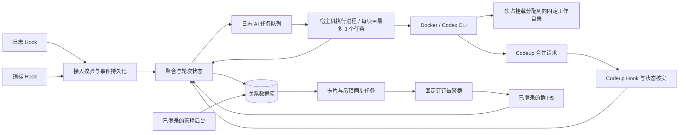
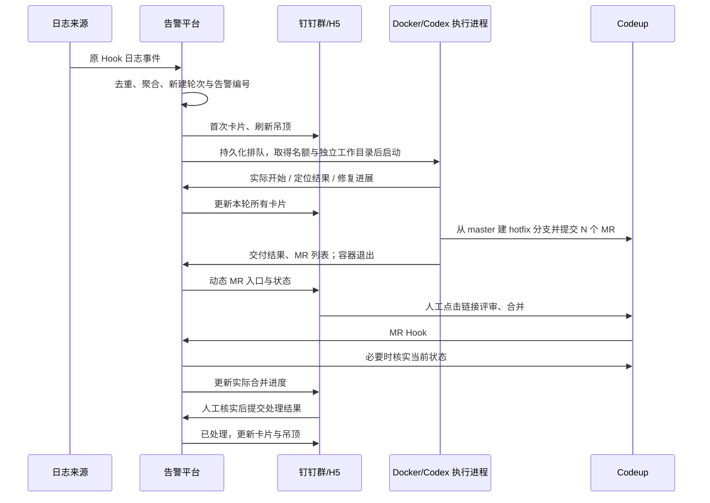

# 告警平台整体设计

版本：V1；确认日期：2026-10-05。本文落实已确认的业务范围和流程，[数据库设计](database.md)规定实体、约束及事务，[AI 执行流程](ai-runtime.md)规定 Docker、Codex CLI、项目排队和修复交付。首版代码和隔离 MySQL/Docker 验证已经建立；实际完成范围及真实外部服务待验收项见[实施记录](../../implementation/issue-1.md)。

卡片字段与交互继续以[告警卡片方案确认](../dingtalk-log-alert/告警卡片方案确认.md)及各卡片设计为准。本文补齐平台能力，不重新设计卡片外观；领域术语统一见 [CONTEXT.md](../../../CONTEXT.md)。

已发布的 [V1 开发规格与验收清单（Issue #1）](https://github.com/mylxy/ai-alertops/issues/1)汇总用户故事、实现决定和已确认测试边界，作为本次同一开发任务分阶段实现的完整规格；按用户补充要求，不拆分或创建子 Issue。本文及数据库、AI 文档保留详细设计说明，变更时应同步规格中受影响的决定。

## 1. 已确认的范围

| 范围 | 本版决定 |
| --- | --- |
| 平台建设 | 全新建设；旧 `alarm-plaform`、`alert-center` 仅作逻辑参考，不迁移数据、用户或未完成告警，不兼容旧群消息按钮 |
| 告警入口 | 日志和指标仍由原有 Hook 触发，保留入口和来源报文契约；内部重新实现鉴权、持久化和处理 |
| 告警归属 | 一个告警归属一个固定告警群；同轮可在该群有多条卡片消息 |
| 路由变化 | 不设计跨群处理、退订善后、历史补发或告警迁群；调试配置变化不自动移动既有轮次 |
| 登录 | 本企业钉钉账号快捷登录，首次通过身份验证自动成为普通用户；H5 和管理后台均须登录 |
| 权限 | `USER` 普通用户、`ADMIN` 管理员；账号可用或停用，无待审批角色 |
| 后台 | 普通用户和管理员均可查询平台全部告警及统计；管理员额外管理配置、账号权限；后台本版不提供告警处理操作 |
| 群操作 | 可用账号且属于当前告警群的用户，才能通过群卡片或群 H5 处理该群告警 |
| AI | 新日志告警轮次自动排队；固定服务器 Docker，每任务新容器，执行器为 Codex CLI |
| 项目并发 | 同项目最多 3 个修复任务执行，其余 FIFO 排队；每项目预置 3 个固定工作目录，各目录独立 Git 克隆，每次只分配给一个任务 |
| 修复交付 | 定位后从各受影响仓库最新 `origin/master` 建普通分支，向 `master` 提交一个或多个 Codeup MR |
| 修复分支 | `hotfix-YYYYMMDD-HHmmssSSS-<告警编号>`；时间精确到毫秒，时区 `Asia/Shanghai` |
| 合并反馈 | 点击卡片的 MR 链接前往 Codeup；实际合并经 Hook 回传后更新卡片，评审通过不等于已经合并 |
| NOTICE | 业务提示卡，仅通知，不启动 AI、不产生处理状态、不计入未完成统计 |

本版不增加认领、接管、人工重开、AI 手动重试、自动合并、自动发布。指标缺失恢复事件的例外关闭仍暂缓，不通过超时把它标记为已恢复。

## 2. 组成与职责

首版采用一个平台后端、一个关系数据库和固定服务器上的宿主机执行进程。后端内部划分接入、告警、身份、通知和查询职责；不要求拆成微服务，不额外引入消息中间件或容器编排集群。后台任务先使用数据库持久化队列。

图中的数据库读写均由平台后端执行。Codex 不直接写业务数据库或钉钉卡片，宿主机执行进程通过受鉴权的任务接口汇报进度。浏览器只访问服务端 API；后台查询与配置写接口分别授权。

每个项目的三个工作目录各自保存仓库克隆、Skill 和文档；每个任务使用其中一个目录并创建自己的普通 hotfix 分支。任务执行结束、产物保存且工作目录检查通过后释放目录，无需等待 MR 合并。某个目录异常时只阻塞该目录，其他健康目录继续执行；三个目录都被占用或阻塞时，后续任务继续排队。

## 3. 身份、角色与操作范围

### 登录与账号

1. 钉钉完成授权，平台服务端校验授权回调、换取并验证企业身份，确认属于配置的企业；客户端提交的姓名、用户 ID 或企业 ID 不能作为身份依据。
2. 按已验证的企业、应用与身份类型映射平台账号。首次登录创建 `ACTIVE / USER`；之后登录只更新允许更新的展示资料，保留已有角色和停用状态。
3. 创建平台登录会话。浏览器授权流程校验 `state` 与会话绑定；会话过期重新登录。H5 内免登仍属于经过服务端验证的登录，打开页面本身不等于已登录。
4. 首位管理员通过部署时明确指定并验证的钉钉身份初始化，不把任意首位登录者提升为管理员。后续管理员在后台调整角色、停用账号并记录审计。

同一人的 `userId`、`unionId`、`openId` 等标识只有在官方响应证明映射后才关联，不假定跨企业或跨应用相同。会话可使用缓存，但用户角色、停用状态和群权限由服务端检查，角色调整不能因旧会话长期失效。

### 权限矩阵

| 能力 | 普通用户 USER | 管理员 ADMIN |
| --- | --- | --- |
| 后台查询全部告警、记录、AI/MR 进度及统计 | 允许 | 允许 |
| 后台追加备注、结束告警 | 本版不提供 | 本版不提供 |
| 本人所在群的 H5 和卡片处理 | 账号可用、当前仍为群成员时允许 | 同样检查群成员身份 |
| 非本人所在群的处理入口 | 拒绝；可在后台查询 | 拒绝；可在后台查询 |
| 项目、仓库、资源、固定群路由和集成配置 | 不允许 | 允许 |
| 用户角色调整与账号停用 | 不允许 | 允许并审计 |

H5 操作每次校验登录用户、账号状态、当前群成员关系、轮次固定归属群和当前主状态。链接中的群 ID 只是定位参数；管理员角色也不绕过群成员校验。群成员关系从可信钉钉接口或已验证事件维护，过期或不能确认时拒绝写操作，不使用永久有效的本地名单。

卡片服务端回调通过钉钉回调的官方校验方式确认调用方及操作者，再映射同一平台账号。卡片回调不依赖 H5 Cookie；尚未完成平台首次登录的用户须先登录开通，停用账号不能通过卡片绕过限制。成功操作记录真实操作者，不能信任表单里的作者或时间。

## 4. Hook、聚合与轮次

### 处理顺序

1. 在原 Hook 入口校验来源身份、报文类型、必填字段和批次结构。鉴权失败不进入业务；兼容旧字段名称不等于放弃来源校验。
2. 将来源解析为受信任的 `source + environment`，把每条上游记录规范化为事件。有效批次在持久化成功后才确认接收；业务处理可异步重试，不能先返回成功再只放进内存队列。
3. 根据资源和告警类型查唯一固定群路由。缺配置的合法事件保留并显示失败原因，不静默丢弃或投递到默认陌生群。
4. 区分“同一事件重投”“同类问题”“同一轮次”，在事务内归属事件、更新轮次，并写入需要执行的同步任务。
5. 新日志轮次同时创建唯一 AI 任务；新指标轮次不创建 AI；NOTICE 只安排提示卡投递。

### 三种标识不能混用

| 标识 | 作用 | 设计口径 |
| --- | --- | --- |
| 事件去重键 | 判断上游是否重投同一事件 | 优先用来源稳定事件 ID 或投递 ID；批次须细分到事件 |
| 问题聚合键 | 判断是否同类异常 | 日志沿用 `ServiceKey + MessageSha`，指标沿用 `InstanceId + MetricKey`，都限定可信来源、环境和资源 |
| 轮次识别依据 | 判断事件属于哪次发生到结束的过程 | 指标使用规范化的 `startsAt` 配合问题键；日志结合可靠发生时间与轮次结束边界 |

日志 `ServiceKey = NamespaceName + "_" + ContainerName`，`MessageSha = SHA256(完整 Message)`；Trace ID 是排查证据，不是聚合键。实现时按结构化字段编码键，不能因简单分隔符拼接产生歧义；聚合规则变化需版本化，不能静默重新归属历史数据。

指标 `startsAt` 代表一次告警周期，不是每次观测的事件 ID。相同周期的持续 firing 可以带来新观测；不能仅按 `startsAt` 去掉所有后续值。原始时间保留精度，另存统一毫秒时刻用于展示、排序，不能先格式化到秒后再判定周期是否相同。

若日志 Hook 没有稳定事件 ID，仅凭相同正文无法区分真实重复异常和重复投递。来源适配器记录去重依据及可信程度；不能承诺严格一次计数。没有可靠轮次归属依据的迟到事件进入 `NEEDS_REVIEW`，后台展示原因，本版不提供随意指定轮次的修复入口。接收重试不得触发同一已识别轮次的第二次 AI。

### 轮次归属规则

- 新问题首次有效触发：创建轮次并分配不可变、全平台唯一 `alert_no`；同轮事件、卡片、备注和 AI/MR 都使用这个编号。
- 未完成轮次的正常新事件：追加到该轮次，保留已有人工进度。每个问题最多一个未完成轮次。
- 日志结束后的事件：可靠发生时间属于旧轮次的，归回旧轮次且不重开；明确发生在关闭后才新建轮次。时间缺失、边界冲突或无法确定归属时保留为待核实事件。
- 指标 resolved：必须匹配同一问题的同一 `startsAt` 周期，才能保存恢复时间、恢复值并结束该轮；重复恢复无副作用。
- 指标旧周期回调：只归原轮次。已恢复周期的迟到 firing 不重开；从未见过的 resolved 先保留待匹配，不能拿它关闭当前新周期。
- 同一问题的不同 `startsAt` 在旧轮未恢复时重叠：视为来源或聚合冲突，保留待核实，不推断旧轮已恢复，也不静默合并两个周期。

若真实来源允许同实例、同指标存在独立的并行维度或规则，需通过报文验收再确认聚合键是否增加维度，不能把这个能力当成现有代码已经支持。

## 5. 业务主状态与完整流程

| 类型 | 初始状态 | 进入处理中 | 结束条件 | 终态 |
| --- | --- | --- | --- | --- |
| LOG | `PENDING` | AI 实际开始，或首条人工备注成功保存 | 人工提交非空处理结果 | `HANDLED` |
| METRIC | `PENDING` | 首条人工备注成功保存 | 匹配本轮的有效监控恢复 | `RECOVERED` |
| NOTICE | 无处理状态 | 不适用 | 不适用 | 不适用 |

### 日志告警

图示为常见顺序，人工备注与关闭可在 AI 排队、运行或 MR 评审期间发生。关闭不要求先备注、AI 已完成或 MR 全部合并；需要依据生产验证结果或明确的无需修复理由。关闭时 AI 未开始则跳过，已开始则继续并把后续结果留在原轮次。AI 失败、MR 合并和发布均不自动结束日志告警。

### 指标与 NOTICE

指标 firing 创建或更新本轮卡片；备注只表达人工进展。resolved 匹配本轮后直接恢复，未备注也可恢复。恢复值缺失时展示缺失，不把旧异常值填作恢复值。暂停监控、删除规则、长时间无数据及备注“已修复”均不是恢复事件。

NOTICE 沿用日志类 Hook 的业务提示映射，内部类型统一为 `NOTICE`，保留项目、服务、原始 Message 并向固定群发送提示卡。不创建告警问题、轮次或 AI 任务，不加入吊顶和告警完成率；后台可单独查询通知记录。

### 备注与并发

备注追加保存作者与服务端时间，卡片显示最近三条，H5 可查完整历史。两个不同提交允许文字相同；同一次提交重试只产生一次记录。终态禁止人工追加备注；旧卡片和旧页面也必须执行此校验。

备注与关闭、备注与监控恢复通过同一轮次的事务锁串行决定。先成功保存的备注保留；结束先成功则拒绝后到备注。重复关闭返回首次成功结果，不覆盖结论、人员或时间。自动结果可以追加到终态历史，但不得覆盖人工结论或重开轮次。

## 6. 卡片、H5 与吊顶同步

业务数据库是事实来源。一次有效业务变更在同一事务内保存记录、增加轮次版本并写入同步任务；外部钉钉调用在事务提交后执行。

| 触发 | 更新已有卡片 | 新增群消息 |
| --- | --- | --- |
| 新轮首次告警 | 建立首次实例 | 一张 |
| 同轮新事件、AI/MR 进度、指标恢复 | 更新本轮全部实例 | 不新增 |
| H5 成功追加备注或标记日志已处理 | 更新本轮全部实例 | 每个有效提交向唯一归属群新增一张 |
| 原群卡片中的有效操作 | 更新本轮全部实例 | 本版不另发 |
| 浏览、取消、失败、无效提交、同次重试 | 无业务变更则不更新 | 不新增 |

每张卡片有独立、稳定的投递键和钉钉实例标识；同次发送结果未知时复用标识并核实，不能换新 ID 盲目补发。同步失败保留已保存业务结果，H5 提示“已保存，群消息同步中/失败”，后台重试通知，不重新保存备注或启动 AI。

同一卡片和同一群吊顶的外部请求串行执行，投递前读最新业务版本；合并过时的更新任务。超时未知的调用先协调结果，再继续该目标的后续更新，防止旧状态覆盖新状态。已发送版本只说明最后确认的同步结果，不能作为业务状态。

吊顶及 H5 从相同范围的轮次数据统计：当前群、LOG/METRIC、`PENDING/PROCESSING`。统计按轮次计数，不按事件、卡片或 AI 任务计数；未发送成功的告警仍在查询与统计中。总数大于零开启或刷新吊顶，仅有处理中也展示；总数归零关闭整个原生吊顶，不删除历史卡片、不关闭已打开的 H5。

## 7. 后台查询与统计

普通用户和管理员使用同一查询范围：全平台。第一版包含按告警编号、时间、类型、状态、项目、资源和归属群筛选，查看事件证据、完整处理记录、AI 结果、动态 MR 列表及同步失败原因。NOTICE 单列查询；凭据与认证令牌不属于查询结果。

| 统计 | 口径 |
| --- | --- |
| 当前未完成 | 当前所有 `PENDING/PROCESSING` 轮次，按类型、项目、群分组 |
| 期间新发生 | 首次发生时间落入所选时间段的轮次数；未完成数不被同一时间筛选误截断 |
| 期间完成 | 完成时间落入所选时间段的日志已处理数、指标已恢复数，分别展示 |
| 处理耗时 | 轮次结束时间减首次发生时间；不混同日志事件持续时间或 AI 执行耗时 |
| AI 与 MR | AI 排队/执行/业务结果、必要 MR 总数及实际合并数，不能把 CLI 成功等同于修复成功 |

时间段采用明确业务时区与左闭右开边界；未来若增加完成率须使用同一批轮次作为分母，本版不混算“期间关闭数 / 期间新建数”。先用明细表查询和必要索引，不预建统计仓库或趋势大屏。

## 8. 接入契约与实施前配置

| 边界 | 必须携带或由服务端确认的内容 |
| --- | --- |
| 上游 Hook | 可信来源、类型、资源标识、原始时间、事件/投递标识（若有）、原始业务报文 |
| H5/卡片操作 | 已验证操作者、轮次 ID、操作类型、请求幂等键、内容；群和权限由服务端复核 |
| 执行进度 | AI 任务 ID、执行令牌、顺序号、事件类型、结构化结果；校验任务及仓库归属 |
| Codeup Hook | 验证来源，识别组织、仓库和 MR 身份、回调事件；状态不明或乱序时读权威 API |
| 外部同步 | 固定投递键、业务目标、最新版本、执行状态、失败原因、可重试时间 |

这些是逻辑契约，不在本轮虚构现网 Hook URL、钉钉回调字段或尚未选定的 HTTP 路由。真实入口清单、报文样本、企业/应用配置、群与模板标识、固定服务器和项目路径、仓库映射、凭据引用、CLI 镜像版本、超时与资源上限在接入时填写并验证；它们不改变已确认的业务流程。

## 9. 参考代码与验收

2026-10-05 只读核对 `alert-center`，HEAD `36f07c9`；它已废弃，只提供代码事实参考。

| 代码 | 已核实事实 | 本版处理 |
| --- | --- | --- |
| `backend/internal/api/legacy.go` 的 `summaryPattern` / `alert` | 从 summary 提取实例、指标、值、规则；要求 `startsAt`，恢复要求 `endsAt` | 保留兼容解析并验证真实来源样本 |
| `backend/internal/service/alerts.go` 的 `keys` / `latest` | 指标按 `InstanceId + MetricKey` 查最新记录 | 保留同类问题口径，另做周期匹配 |
| 同文件 `process` | 已结束后 firing 新建；resolved 关闭查到的最新未结束记录；没有比较 `startsAt` | 不继承旧恢复误关新轮次的风险 |
| 同文件 `Log` | 完整 Message 做 SHA-256，配合 ServiceKey 聚合 | 保留口径，补可信来源与环境边界 |
| 指标 DTO 与处理链 | fingerprint 可出现在报文中，但不参与现有匹配 | 可保留作证据，不擅自改成必填主键 |

旧平台更早的代码依据见[卡片方案中的原平台参考](../dingtalk-log-alert/告警卡片方案确认.md#原平台参考依据)。不沿用旧数据迁移、跨群订阅、账号待开通、屏蔽、认领或消息发送频率。

实施验收至少覆盖：首次登录默认角色与停用保留；普通用户全局只读及群操作隔离；Hook 重投、乱序、旧恢复、新旧轮次分离；并发备注与结束；同轮多卡一致性和同步失败；吊顶从零到有、仅处理中、归零；同项目排队与服务器重启；动态多个 MR、部分交付失败、评审通过但未合并。数据库和 AI 的更细验收分别见后两份文档。
