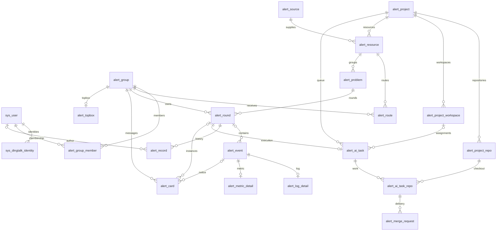

# 告警平台数据库设计

版本：V1；日期：2026-10-05。本文是[整体设计](README.md)的逻辑数据模型，覆盖 23 张业务表、主要字段、唯一约束、查询索引与事务。它不是可执行 DDL；字段长度、索引字节数和查询计划须在实际 MySQL 版本上验证后生成建表脚本。

## 1. 建模与存储约定

- 单企业部署，企业标识来自可信服务端配置；不设计多租户 SaaS。钉钉身份及外部资源仍保存所属企业/组织和应用范围，防止外部标识串用。
- 使用 MySQL InnoDB、`utf8mb4`、`utf8mb4_bin`。表名、字段名不超过 32 字符，中文注释说明含义、单位和占位值。
- 全表包含应用分配的正数 `id BIGINT`、`create_time`、`update_time`，不使用自增。内部 ID 统一采用 Snowflake 类 64 位生成器；不同生成进程分配不同节点号，时钟回拨时等待或失败，不能发出可能重复的 ID。
- 告警编号为独立字段 `alert_no`，采用 `AL` 加内部轮次 ID 的十进制表示；数据库全局唯一、不可修改。示例中的 `AL000123` 仅用于说明短编号，实际编号不要求补零。编号不代替内部关联 ID 或日志 Trace ID。
- 所有字段显式 `NOT NULL`；可选字符串 `''`、未发生时间或尚未关联的 ID 为 `0`，均在字段说明中定义。有效实体 ID 必须大于零；需要“缺失”的数值由独立可用状态表达，不能把零当缺失。
- 业务状态使用 `VARCHAR(50)` 和大写字符串，不用数据库 ENUM。时间使用 Unix 毫秒有符号 BIGINT，展示按 `Asia/Shanghai` 转换；原始时间及精度另外保留。
- 禁止物理外键。关联字段使用完整的被引用表名，如 `alert_round_id`；应用在事务内校验关联。多角色关系采用下文明确的语义名称并标明目标。
- 配置以启用/停用维护，账号用可用/停用维护；首版不复用被停用的业务键，不硬删除存在历史引用的配置。事件、备注、操作记录追加保存；历史卡片和轮次不因停用配置删除。
- 密钥、钉钉 token、Git 凭据、Codex 凭据不写业务表正文，只保存凭据引用。证据与日志须脱敏、限制大小；原始报文和执行产物按运维保留策略归档，清理不能断开轮次、记录与 MR 的必要引用。

下表省略所有表共有的 `id / create_time / update_time`。字段列表是核心字段清单；普通文案长度及展示快照属于 DDL 阶段的机械细化，不增加新的业务实体。

## 2. 关系总览

图中 `alert_card` 对轮次、NOTICE 事件为二选一关联；事件尚未完成归属或为 NOTICE 时没有轮次。工作区可先后服务多个任务，但同时最多一个活动任务；排队任务尚未分配工作区。`sys_audit_log` 和 `alert_job` 是审计及持久任务，目标按下文的受限类型引用，不展开所有边。

## 3. 身份与审计：3 张表

| 表 | 主要字段 | 唯一约束与查询索引 |
| --- | --- | --- |
| `sys_user` | `display_name`、`avatar_url`、`role`（USER/ADMIN）、`account_status`（ACTIVE/DISABLED）、`last_login_time` | 以 ID 定位；账号管理按角色、状态查询，按真实规模决定是否加组合索引 |
| `sys_dingtalk_identity` | `sys_user_id`、`corp_id`、`app_id`、`identity_type`（USER_ID/UNION_ID/OPEN_ID）、`identity_value`、`verified_time` | 唯一 `(corp_id, app_id, identity_type, identity_value)`；索引 `sys_user_id` |
| `sys_audit_log` | `actor_sys_user_id`、`actor_type`（USER/SYSTEM）、`action_type`、`target_type`、`target_id`、`request_key`、`before_data`、`after_data`、`result_status`（SUCCESS/FAILED）、`occurred_time` | 唯一 `request_key`；索引 `(target_type, target_id, occurred_time, id)`，人员操作查询按需使用 `(actor_sys_user_id, occurred_time)` |

`actor_sys_user_id` 明确引用 `sys_user.id`，系统行为为 0。仅有经过验证的身份值才插入身份行，不为缺失的 openId/unionId 插入空值行，也不按昵称合并账号。同一用户可以有多种身份，登录与卡片回调解析到同一个 `sys_user_id`。

审计记录配置变更、角色调整、账号停用及关键管理失败；人工告警处理历史放 `alert_record`。审计正文过滤凭据，不因记录前后快照而保存明文密钥。无外部请求键的系统行为使用本次操作生成的稳定键，重试复用。

两种固定角色直接放用户表，不建通用角色、菜单、权限点关系表。登录会话不作为领域表；其失效机制须支持停用账号和角色变更及时生效。

## 4. 项目、工作区、来源与固定路由：8 张表

| 表 | 主要字段 | 唯一约束与查询索引 |
| --- | --- | --- |
| `alert_project` | `project_code`、`name`、`workspace_root`、`runner_image`、`credential_ref`、`config_status`（ENABLED/DISABLED） | 唯一 `project_code`；唯一规范化后的 `workspace_root` |
| `alert_project_workspace` | `alert_project_id`、`slot_no`（仅 1/2/3）、`workspace_path`（宿主机规范化实际路径）、`workspace_status`（READY/OCCUPIED/BLOCKED）、`active_alert_ai_task_id`、`assignment_version`、`blocked_reason`、`last_check_time` | 唯一 `(alert_project_id, slot_no)`、`workspace_path`；索引 `(alert_project_id, workspace_status, slot_no)` |
| `alert_project_repo` | `alert_project_id`、`repo_code`、`relative_path`（相对于任一工作区的相同路径）、`provider`（CODEUP）、`organization_id`、`repository_id`、`git_url`、`base_branch`（master）、`credential_ref`、`config_status` | 唯一 `(alert_project_id, repo_code)`、`(alert_project_id, relative_path)`；索引 `(organization_id, repository_id)` |
| `alert_source` | `source_code`、`source_type`（LOG/METRIC）、`environment`、`adapter_type`、`auth_ref`、`config_status` | 唯一 `source_code`；入口鉴权定位来源后使用主键 |
| `alert_resource` | `alert_source_id`、`alert_project_id`、`resource_type`（SERVICE/INSTANCE）、`resource_key`、`name`、`config_status` | 唯一 `(alert_source_id, resource_type, resource_key)`；索引 `alert_project_id` |
| `alert_group` | `corp_id`、`app_id`、`conversation_id`、`name`、`config_status`、`integration_status`（UNVERIFIED/READY/FAILED）、`last_error` | 唯一 `(corp_id, app_id, conversation_id)` |
| `alert_route` | `alert_resource_id`、`alert_group_id`、`alert_type`（LOG/METRIC/NOTICE）、`config_status` | 唯一 `(alert_resource_id, alert_type)`；索引 `alert_group_id` |
| `alert_group_member` | `alert_group_id`、`sys_user_id`、`member_status`（MEMBER/LEFT/UNKNOWN）、`verified_time`、`expire_time`、`verification_source` | 唯一 `(alert_group_id, sys_user_id)`；索引 `(sys_user_id, member_status)` |

一个项目可以包含多个仓库和监控资源；LOG、NOTICE 的服务资源可以相同，路由按类型区分，但每种类型只有一个归属群。轮次创建后保存归属群快照；后续投递读取轮次，不临时重算路由把历史告警搬群。

每项目预置三个工作区，分别独立克隆项目仓库，目录长期复用，不为每个任务重新克隆。`slot_no` 使用数据库 CHECK 及应用校验限制为 1、2、3，配合唯一索引限制每项目最多三条工作区记录。就绪前完成三个目录的初始化检查；缺失或未通过检查的目录不能领取任务，不临时增加第四个目录来绕过阻塞。

`active_alert_ai_task_id` 明确引用 `alert_ai_task.id`。READY 时该值为 0；OCCUPIED 时引用当前 STARTING/RUNNING/FINALIZING 任务；BLOCKED 时若旧容器是否退出尚未查明，保留当前任务引用，确认停止后才可清零。每次分配递增 `assignment_version`，回收同时核对任务 ID 和该版本，防止旧执行进程释放已经重新分配的目录。

仓库实际路径由工作区路径和仓库 `relative_path` 共同确定，三个工作区分别拥有独立 `.git`、工作文件与构建输出。配置时解析实际路径，拒绝工作区重复、工作区互相嵌套、仓库父子重叠及通过符号链接逃逸/共写同一目录；禁止跨项目共享可写 checkout。唯一索引不能单独识别父子重叠，配置事务还须串行校验路径集合。

项目或仓库配置、Skill 基线同步仅在项目无活动任务时进行；异常工作区保留现场，不用配置更新覆盖未保存修改。单个工作区解除阻塞需确认旧执行已停止并通过目录检查，不影响其余健康工作区。任务保存工作区及配置快照；历史任务不随路径调整改写。

群成员表是已验证关系的缓存与审计依据，过期行不能直接授权。四类卡片模板使用已发布模板的配置引用，首版不建在线模板编辑系统或多层订阅模型。

## 5. 告警事实与历史：6 张表

### `alert_problem`：同类问题

主要字段：`alert_resource_id`、`alert_type`（LOG/METRIC）、`key_version`、`grouping_key`、`grouping_data`、`title`。

- 唯一 `(alert_resource_id, alert_type, key_version, grouping_key)`。键使用规范编码后摘要，`grouping_data` 保存组成字段；命中摘要时核对原始组成，冲突必须拒绝，不能误合并。
- 资源已经包含来源及环境范围，不能拿另一个来源的资源 ID 复用问题键。
- 问题描述同类异常，本轮状态、群归属、次数和人工结果均由 `alert_round` 持有。

### `alert_round`：一次发生到结束

| 字段 | 含义 |
| --- | --- |
| `alert_problem_id`、`alert_group_id` | 所属问题及本轮固定归属群 |
| `alert_project_id`、`alert_resource_id`、`alert_type` | 创建时从问题资源派生的查询字段，由服务端维护一致；不接受客户端任意指定 |
| `alert_no`、`round_no` | 全局唯一告警编号、同一问题内递增轮次号 |
| `round_status` | PENDING/PROCESSING/HANDLED/RECOVERED；按类型限制合法终态 |
| `open_marker` | 未完成为 0，终态为本行 ID；与状态同一事务变化 |
| `cycle_key`、`cycle_data` | METRIC 为精确 startsAt 的规范化周期依据；LOG 使用本轮编号形成非空独立键；另存原始依据 |
| `event_count`、`count_quality` | 已归属有效事件数及可信程度 EXACT/BEST_EFFORT；不包含已识别的重复投递 |
| `first_event_time`、`last_event_time`、`last_receive_time` | 发生与接收时间分开保存，乱序不会使最早/最近时间倒退 |
| `end_time`、`end_record_time` | 日志实际提交关闭/指标监控恢复时刻，以及平台落库时刻 |
| `handled_sys_user_id`、`result_text` | 引用 `sys_user.id` 的人工处理人及非空结果；指标自动恢复处理人为 0 |
| `version` | 本轮对外可见内容的单调递增版本 |

唯一约束：`alert_no`、`(alert_problem_id, round_no)`、`(alert_problem_id, open_marker)`、`(alert_problem_id, cycle_key)`。`open_marker` 使数据库能够限制一个问题最多一个未完成轮次，同时保留多个终态；不能依赖 Redis 锁作为唯一保护。

核心查询索引：`(alert_group_id, round_status, alert_type, first_event_time, id)` 服务群未完成列表；`(first_event_time, id)` 服务全局时间列表；`(alert_project_id, first_event_time, id)` 服务项目筛选；`(end_time, alert_type)` 服务完成统计。资源、状态的其他组合按真实查询计划补充，不预先建立所有排列。

### `alert_event`：收到的来源事件

主要字段：`alert_source_id`、`alert_resource_id`、`alert_round_id`、`alert_type`、`event_type`（LOG/FIRING/RESOLVED/NOTICE）、`dedup_key`、`dedup_quality`（STRONG/WEAK/NONE）、`source_event_id`、`payload_hash`、`occurred_time`、`received_time`、`source_time_raw`、`payload`、`process_status`（RECEIVED/APPLIED/NEEDS_REVIEW/FAILED）、`process_error`。

- 唯一 `(alert_source_id, dedup_key)`；索引 `(process_status, received_time, id)` 服务待处理扫描，`(alert_round_id, occurred_time, id)` 服务证据查询。
- 强去重键来自可验证的来源事件/投递身份。相同键、相同内容返回原结果；相同键却不同业务内容记录冲突，不能覆盖旧事件。
- 无可靠键时为本次接收分配非空键，不把弱正文摘要作为硬去重唯一键；`dedup_quality` 明确此时计数局限。HTTP 重试是否可合并依来源可用信息决定。
- NOTICE 或尚未归属轮次时 `alert_round_id=0`；资源尚未匹配时 `alert_resource_id=0`。`APPLIED` 的 LOG/METRIC 必须有有效资源和轮次，NOTICE 必须有可投递目标。
- 合法事件持久化后用状态扫描恢复处理；无需给每条监控事件再建一份内存消息队列。无法解析的请求记接入错误，不制造伪造告警。

### `alert_log_detail` 与 `alert_metric_detail`：类型证据

| 表 | 主要字段 | 约束 |
| --- | --- | --- |
| `alert_log_detail` | `alert_event_id`、`namespace_name`、`container_name`、`service_key`、`trace_id`、`class_name`、`message_sha`、`message`、`source_level` | 唯一 `alert_event_id`；对应 LOG 或 NOTICE；消息摘要按完整上游业务 Message 计算，展示副本按策略脱敏 |
| `alert_metric_detail` | `alert_event_id`、`instance_id`、`instance_name`、`metric_key`、`metric_rule`、`metric_value_raw`、`value_status`（AVAILABLE/MISSING/INVALID）、`fingerprint`、`starts_at_raw`、`ends_at_raw`、`starts_at`、`ends_at`、`labels`、`annotations` | 唯一 `alert_event_id`；仅对应 METRIC；raw 时间保留源精度，毫秒字段只作统一排序与展示 |

同一事件恰有一个适用详情，批次中每条独立保存。日志中的业务项目/服务展示名来自资源映射及事件证据。指标值以原文保留，比较或统计时由明确单位的适配器解析；恢复缺值时 `value_status=MISSING`，不填旧异常值或零值。

### `alert_record`：轮次完整处理历史

主要字段：`alert_round_id`、`actor_sys_user_id`、`actor_type`（USER/AI/SYSTEM）、`actor_name`（当时显示名快照）、`record_type`（NOTE/LOG_HANDLED/METRIC_RECOVERED/AI_PROGRESS/AI_RESULT/MR_PROGRESS）、`entry_point`（CARD/H5/HOOK/RUNNER）、`operation_key`、`request_hash`、`content`、`structured_data`、`occurred_time`。

唯一 `(alert_round_id, operation_key)`，查询索引 `(alert_round_id, occurred_time, id)`。幂等键包括可信入口范围，绑定操作者、操作类型及内容摘要；同键不同内容或身份拒绝。系统/AI 的操作者 ID 为 0，不能伪装成人工。

备注与人工处理结果不可原地改写；AI 进度或 MR 状态变化也追加历史，MR 表保存当前状态。AI 回调顺序号和 Codeup 回调标识转换为稳定操作键，重复事件不再追加记录。人工内容相同但提交键不同则是不同备注。

## 6. AI 执行与交付：3 张表

### `alert_ai_task`

| 字段组 | 核心字段与含义 |
| --- | --- |
| 归属 | `alert_round_id`、`alert_project_id`、`alert_project_workspace_id`；只允许 LOG，尚未分配工作区时工作区 ID 为 0 |
| 排队与执行 | `execution_status`：QUEUED/STARTING/RUNNING/FINALIZING/SUCCEEDED/FAILED/SKIPPED；`active_marker` 活动任务为 0，其余为本行 ID；`workspace_version` 为领取时的工作区分配版本 |
| 业务进展 | `phase`：WAITING/DIAGNOSING/LOCATED/REPAIRING/VERIFYING/DELIVERING/FINISHED；`business_result`：UNDETERMINED/FIX_PROPOSED/NO_ISSUE/UNRESOLVED |
| 交付完整性 | `delivery_status`：PENDING/NOT_REQUIRED/COMPLETE/PARTIAL_FAILED；`delivery_set_status`：OPEN/SEALED |
| 分支与执行快照 | `branch_name`、`context_snapshot`、`runner_image`、`workspace_path`、`executor_id`、`execution_token_hash` |
| 容器与进度 | `container_id`、`container_name`、`last_sequence`、`heartbeat_time`、`artifact_path`、`error_code`、`error_message` |
| 时间 | `queued_time`、`claimed_time`、`started_time`、`finished_time` |

唯一 `alert_round_id` 保证每轮至多一次 AI；唯一 `(alert_project_workspace_id, active_marker)` 保证一个工作区至多一个活动任务。STARTING/RUNNING/FINALIZING 都必须关联同项目的有效工作区，`active_marker=0`；排队及终态使用本行 ID，避免所有未分配任务在工作区 0 上冲突。任务一经分配，保留工作区归属作为历史，不在执行中换目录。

领取时持有项目与工作区行锁，选择最早的可执行排队任务及一个 READY 工作区，同事务登记任务、工作区占用和分配版本。三个固定工作区、工作区唯一活动任务及事务关联校验共同保证每项目最多三个活动任务；不能由多个执行进程先无锁查数量再分别启动。索引 `(alert_project_id, execution_status, queued_time, id)` 服务 FIFO，`(execution_status, heartbeat_time)` 服务运行核对。

`SUCCEEDED` 只说明任务完整执行并产生有效结果，不表示根因已修复或已上线；`NO_ISSUE/UNRESOLVED` 也可能是正常完成的业务结论。`COMPLETE` 表示必要代码交付均已形成 MR，不表示 MR 已合并；合并汇总从 MR 现态计算。执行失败保留已完成的仓库和 MR。

分支名在定位后、创建第一个实际 Git 分支前生成并写入任务；同任务后续仓库复用该值。未定位或被跳过的任务允许 `branch_name=''`，因此不为可空占位字段建立全局唯一索引；各仓库实际建分支前校验重名归属。

### `alert_ai_task_repo`

主要字段：`alert_ai_task_id`、`alert_project_repo_id`、`scope_status`（REQUIRED/EXCLUDED）、`base_revision`、`head_revision`、`branch_name`、`repair_status`（PENDING/RUNNING/DONE/FAILED/NOT_NEEDED）、`verification_status`（NOT_RUN/PASSED/FAILED/UNAVAILABLE）、`delivery_status`（PENDING/DELIVERED/FAILED/NOT_REQUIRED）、`required_mr_count`、`verification_summary`、`error_message`。

唯一 `(alert_ai_task_id, alert_project_repo_id)`。识别到受影响仓库时先建记录，再做修改和交付；这样某仓库在创建 MR 前失败也不会从修复范围中消失。`required_mr_count` 在交付集合封口时明确，允许大于 1；关联仓库必须属于任务项目。

### `alert_merge_request`

主要字段：`alert_ai_task_repo_id`、`provider`、`organization_id`、`repository_id`、`merge_request_id`、`display_number`、`url`、`title`、`source_branch`、`target_branch`、`head_revision`、`merge_revision`、`merge_status`（OPEN/MERGED/CLOSED）、`review_status`（UNKNOWN/PENDING/APPROVED/REJECTED）、`provider_status`、`provider_update_time`、`last_verified_time`、`merged_time`。

唯一 `(provider, organization_id, repository_id, merge_request_id)`；索引 `(alert_ai_task_repo_id, merge_status)`。外部不可变 ID 与页面显示编号分别保存，不混用不同 Codeup API 的 ID 表达。关联仓库和目标 `master` 都须核对；MR URL 来自允许的 Codeup 域和正确仓库，不能直接呈现任意回调链接。

每个任务可以关联任意数量的 MR，不使用 `mr1/mr2` 字段或只存一段 JSON 列表。必要集合只有在任务封口、所有 REQUIRED 仓库交付成功、各仓库必要 MR 数量齐全且这些 MR 全部实际合并时，才能显示“修复分支全部已合并”。已关闭但未合并不算成功。评审通过、CLI 成功或部分 MR 已合并均不代替这些条件。

## 7. 卡片、吊顶与可靠任务：3 张表

| 表 | 主要字段 | 唯一约束与索引 |
| --- | --- | --- |
| `alert_card` | `alert_round_id`、`alert_event_id`、`alert_group_id`、`card_type`（LOG/METRIC/NOTICE）、`delivery_key`、`out_track_id`、`template_id`、`template_version`、`delivery_status`（PENDING/SENDING/SENT/UNKNOWN/FAILED）、`desired_version`、`sent_version`、`last_error` | 唯一 `delivery_key`、`out_track_id`（投递前分配非空值）；索引 `(alert_round_id, id)`、`(alert_event_id, id)` |
| `alert_topbox` | `alert_group_id`、`out_track_id`、`desired_status`（OPEN/CLOSED）、`observed_status`（UNKNOWN/OPEN/CLOSED）、`desired_version`、`sent_version`、`last_error`、`last_sync_time` | 唯一 `alert_group_id`；outTrack 在需要开启时分配，未分配不建立唯一空值约束 |
| `alert_job` | `job_type`、`job_key`、`target_type`、`target_id`、`target_version`、`payload`、`job_status`（PENDING/RUNNING/SUCCEEDED/FAILED/UNKNOWN）、`attempt_count`、`next_run_time`、`lease_owner`、`lease_until`、`last_error` | 唯一 `job_key`；索引 `(job_status, next_run_time, id)`，目标查询 `(target_type, target_id, job_status)` |

卡片的 LOG/METRIC 只关联轮次（事件 ID 为 0），NOTICE 只关联已应用的 NOTICE 事件（轮次 ID 为 0），且群与业务归属一致。首次投递键按轮次生成；H5 通知投递键按有效操作记录生成；NOTICE 按事件生成。卡片表不复制一套可独立修改的告警状态。

吊顶一群一份，因为群本身已经绑定企业应用。计数实时读取轮次，表中保存的是外部同步控制信息。开关调用以该群串行协调；再次开启可以分配新的外部实例，但不能丢失仍待确认的旧调用结果。

`alert_job` 是事务 outbox 与接入补偿队列，首版只允许明确的任务类型：`CARD_SEND`、`ROUND_CARD_SYNC`、`TOPBOX_SYNC`、`AI_PROGRESS_APPLY`、`MR_RECONCILE`。payload 校验对应结构，不做可执行任意命令的通用工作流。AI 排队由 `alert_ai_task` 负责，上游告警接收由 `alert_event` 负责，不在三个队列之间重复保存同一任务。

AI 进度和 Codeup 回调先完成来源校验，持久化唯一 job 后确认接收；进度应用与业务记录、下游通知同事务提交。先收到 MR Hook、后收到 AI 的 MR 关联报告时，保留 `MR_RECONCILE` 并等待可验证关联，不能绑定到“这个项目最新告警”。

数据库任务可以超时回收执行租约，但发往外部系统的未知结果必须先核实。自动重试只覆盖接入处理、查询和消息同步；不得通过 job 重试重新运行 Codex 或创建第二个修复容器。

## 8. 关键事务与并发约束

| 操作 | 同一事务内提交 | 外部动作 |
| --- | --- | --- |
| 首次事件入库 | 事件、类型详情；重复键校验内容一致 | 提交后确认 Hook 接收 |
| 创建日志轮次 | 锁问题，分配轮次/编号，归属事件，创建唯一 AI 任务、首次卡片及同步 job | 后续发卡、启动 AI |
| 创建指标轮次 | 锁问题，校验周期与唯一未完成约束，归属事件、首次卡片及同步 job | 后续发卡 |
| 持续事件或恢复 | 锁问题及目标轮次，核对周期，更新次数/时间/状态、记录和版本，写同步 job | 更新卡片与吊顶 |
| H5/卡片备注或关闭 | 当前账号/群权限校验，锁轮次，检查幂等键与终态，追加记录、改状态/版本；H5 有效提交新增唯一通知卡及 job | 提交后同步，不因投递失败回滚备注 |
| 领取 AI 任务 | 锁项目、工作区及轮次/任务，核对 FIFO、READY 目录和轮次未结束；任务改 STARTING/active_marker=0，工作区改 OCCUPIED 并绑定任务及递增分配版本 | 提交后启动稳定命名容器 |
| AI 收尾与释放 | 核对原任务、工作区及分配版本；确认停止与目录检查结果后，任务进入终态并改 active_marker 为本行 ID，清空工作区当前任务，按检查结果改 READY/BLOCKED | 停止确认、产物保存和目录检查在提交前完成；状态不明则继续保留占用 |
| AI/MR 结果 | 校验任务/仓库/回调去重，写任务、交付和记录，增加轮次版本及 job | 更新原轮次卡片，不更改人工终态 |
| 配置或角色变更 | 校验管理员与有效关联，改配置/账号并写审计 | 刷新相关会话/权限缓存 |

锁顺序：涉及项目时先项目，再工作区（多条按 slot_no 排序）、问题、轮次、AI 任务及其子表；只涉及后半段的事务从所需位置开始。创建问题以唯一索引处理并发插入；冲突重读后再锁。处理进程不在持有数据库锁时调用钉钉、Docker、Codex 或 Codeup。

领取任务与人工关闭都锁轮次：先关闭则领取时标为 SKIPPED；领取后但 CLI 尚未实际开始时，执行进程在启动门槛再次校验。启动确认先成功则后续关闭按“AI 已开始”处理，反之阻止进入执行。这个判定须由执行进程与平台的启动协议实现，不能靠读一次状态后无条件启动。

进度事件的任务令牌与顺序号用于拒绝其他执行实例、重复和倒退更新；已确认结果仍可为已关闭轮次追加历史。任务终态不能因迟到的 RUNNING 事件退回运行。单纯租约过期不代表旧容器停止，释放工作区独占的条件见 [AI 执行流程](ai-runtime.md)。

## 9. 索引、保留与实现验收

列表使用 `(时间, id)` 稳定游标分页，避免大 OFFSET；按编号定位走唯一索引。群未完成统计和 H5 使用同一轮次过滤条件，不从卡片发送成功数反推告警数量。初期不分库分表、不复制独立统计事实；数据量增长后依据实际慢查询和保留策略调整。

DDL 落地前须为每个枚举列补全中文注释和应用状态校验，为非空占位值补齐互斥条件校验，并核算外部 ID、路径与复合唯一键的长度。路径过长不能改用唯一前缀索引；若使用摘要列定位，须核对完整原值、防止冲突误判。

| 验收组 | 必须证明 |
| --- | --- |
| 唯一性 | 并发新轮只创建一次；同问题最多一轮未完成；每轮至多一 AI；每项目至多 3 个活动任务且不共写同一目录；同次提交/卡片/MR 不重复 |
| 身份 | 缺失身份值不造成空值唯一冲突；跨企业、未知身份、停用账号、过期成员关系不能写告警 |
| 轮次 | 精确周期恢复匹配；旧 resolved 不关闭新轮；迟到事件不重开；原始时间精度可追溯 |
| 原子性 | 业务记录与 outbox 同提交；中途失败回滚；消息失败保留业务；重复回调内容冲突可见 |
| 运行与交付 | 同一目录不能重复分配；单个阻塞工作区不影响另外两个，全部阻塞时继续排队；租约过期不双开；旧分配版本不能释放新任务；未生成 MR 的失败仓库仍在必要集合 |
| 查询 | 代表性数据下检查 EXPLAIN、扫描量和分页；计数、处理耗时、事件持续时间和 AI 耗时不混用 |

本次没有执行 DDL、数据库约束测试或性能测试；上述内容是后续实现的验收要求。
